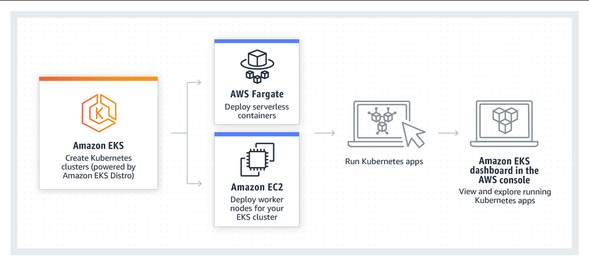
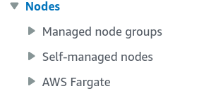
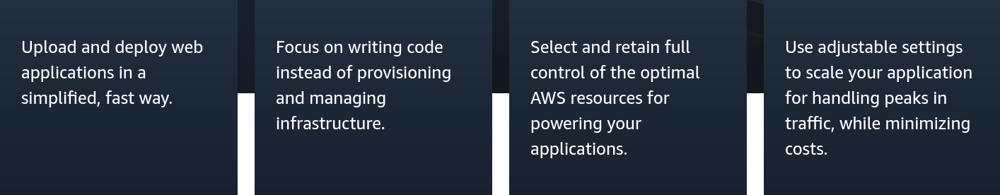
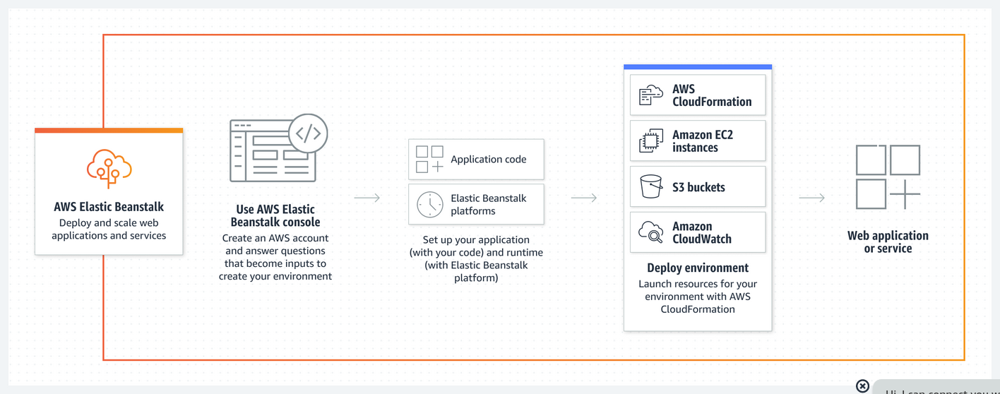
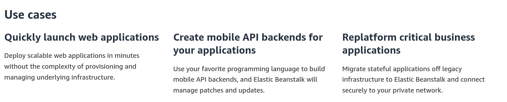
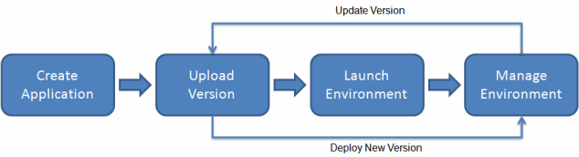
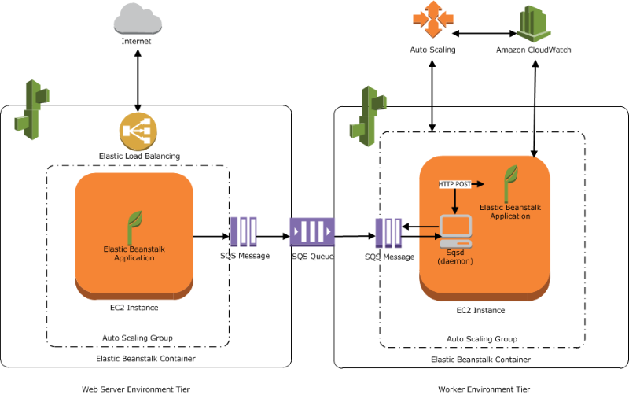

# aws-dev-docs
## What is Amazon EKS?
Amazon Elastic Kubernetes Service (Amazon EKS) is a managed service that **eliminates the need to install, operate, and maintain your own Kubernetes control plane on Amazon Web Services (AWS).** Kubernetes is an `open-source system that automates the management, scaling, and deployment of containerized applications`.

## Features of Amazon EKS

The following are key features of Amazon EKS:

### Secure networking and authentication
> Amazon EKS integrates your Kubernetes workloads with AWS networking and security services. It also integrates with `AWS Identity and Access Management (IAM)` to provide authentication for your Kubernetes clusters.
### Easy cluster scaling
> Amazon EKS enables you to scale your Kubernetes clusters up and down easily based `on the demand` of your workloads. Amazon EKS supports horizontal Pod autoscaling based on CPU or custom metrics, and cluster autoscaling based on the demand of the entire workload.

### Managed Kubernetes experience
> You can make changes to your Kubernetes clusters using **eksctl**, AWS Management Console, AWS Command Line Interface (AWS CLI), the API, kubectl, and Terraform

### High availability
> Amazon EKS provides high availability for your control plane across multiple Availability Zones.
### Integration with AWS services
> Amazon EKS integrates with other AWS services, providing a comprehensive platform for `deploying and managing your containerized applications`. You can also more easily **troubleshoot your Kubernetes workloads with various observability tools**.

## Common use cases in Amazon EKS
- **Deploying high-availability applications:**
Using Elastic Load Balancing, you can make sure that your applications are highly available across multiple Availability Zones

- **Building microservices architectures:**
Use Kubernetes service discovery features with [AWS Cloud Map](https://aws.amazon.com/cloud-map/)
or [Amazon VPC Lattice](https://aws.amazon.com/vpc/lattice/) to build resilient systems.
    >  AWS Cloud Map = Service discovery for cloud resources or IT asset discovery

- **Automating software release process:**
Manage continuous integration and continuous deployment `(CICD) pipelines` that simplify the process of automated `building, testing, and deployment of applications`.
- **Running serverless applications:** Use AWS Fargate
with Amazon EKS to run serverless applications. This means you can focus solely on application development, while Amazon EKS and Fargate handle the underlying infrastructure.
- **Executing machine learning workloads:**
Amazon EKS is compatible with popular machine learning frameworks such as **TensorFlow**, **MXNet, and PyTorch**
. With GPU support, you can handle even complex machine learning tasks effectively.

- **Deploying consistently on premises and in the cloud:**
Use Amazon EKS Anywhere to operate Kubernetes clusters on your own infrastructure using tools that are consistent with Amazon EKS in the cloud.
- **Running cost-effective batch processing and big data workloads:**
Utilize Spot Instances to run your batch processing and big data workloads such as `Apache Hadoop` and `Spark`, at a fraction of the cost. This lets you take advantage of unused Amazon EC2 capacity at discounted prices.
- **Securing application and ensuring compliance:**
Implement strong security practices and maintain compliance with Amazon EKS, which integrates with AWS security services such as AWS Identity and Access Management
(`IAM`), Amazon Virtual Private Cloud (`Amazon VPC`), and AWS Key Management Service (`AWS KMS`). This ensures data privacy and protection as per industry standards.

## Amazon EKS nodes
A Kubernetes node is a machine that runs containerized applications. Each node has the following components:

- **[Container runtime](https://kubernetes.io/docs/setup/production-environment/container-runtimes/)**

    Software that's responsible for running the containers.

- **[kubelet](https://kubernetes.io/docs/reference/command-line-tools-reference/kubelet/)**

    Makes sure that containers are healthy and running within their associated Pod.

- **[kube-proxy](https://kubernetes.io/docs/reference/command-line-tools-reference/kube-proxy/)**

    Maintains network rules that allow communication to your Pods.

    
    ## Managed node groups
    Amazon EKS managed node groups automate the provisioning and lifecycle management of nodes (Amazon EC2 instances) for Amazon EKS Kubernetes clusters.

    `With Amazon EKS managed node groups, you don't need to separately provision or register the Amazon EC2 instances that provide compute capacity to run your Kubernetes applications`. You can create, automatically update, or terminate nodes for your cluster with a single operation. Node updates and terminations automatically drain nodes to ensure that your applications stay available.

    Every managed node is provisioned as part of an Amazon EC2 Auto Scaling group that's managed for you by Amazon EKS. Every resource including the instances and Auto Scaling groups runs within your AWS account. `Each node group runs across multiple Availability Zones that you define`.

    You can add a managed node group to new or existing clusters using the Amazon EKS console, `eksctl`, AWS CLI; AWS API, or infrastructure as code tools including AWS CloudFormation. Nodes launched as part of a managed node group are automatically tagged for auto-discovery by the Kubernetes cluster autoscaler. You can use the node group to apply Kubernetes labels to nodes and update them at any time.

    There are no additional costs to use Amazon EKS managed node groups, you only pay for the AWS resources you provision. These include Amazon EC2 instances, Amazon EBS volumes, Amazon EKS cluster hours, and any other AWS infrastructure. There are no minimum fees and no upfront commitments.

    ## Self-managed nodes

    A cluster contains one or more Amazon EC2 nodes that `Pods` are scheduled on. Amazon EKS nodes run in your AWS account and connect to the control plane of your cluster through the cluster API server endpoint. You're billed for them based on Amazon EC2 prices. For more information, see *Amazon EC2 pricing*

    A cluster can contain several node groups. Each node group contains one or more nodes that are deployed in an Amazon EC2 Auto Scaling group. The instance type of the nodes within the group can vary, such as when using *attribute-based instance* type selection with [Karpenter](https://karpenter.sh/). All instances in a node group must use the Amazon EKS node IAM role.

    Amazon EKS provides specialized Amazon Machine Images (AMIs) that are called Amazon EKS optimized AMIs. The AMIs are configured to work with Amazon EKS. Their components include `containerd`, `kubelet`, and the AWS IAM Authenticator. The AMIs also contain a specialized [bootstrap script](https://github.com/awslabs/amazon-eks-ami/blob/master/files/bootstrap.sh) that allows it to discover and connect to your cluster's control plane automatically.

    If you restrict access to the public endpoint of your cluster using CIDR blocks, we recommend that you also enable private endpoint access. This is so that nodes can communicate with the cluster. Without the private endpoint enabled, the CIDR blocks that you specify for public access must include the egress sources from your VPC. For more information, see *Amazon EKS cluster endpoint access control*. 

    ## AWS Fargate
    This topic discusses using Amazon EKS to run Kubernetes Pods on AWS Fargate. Fargate is a technology that provides on-demand, right-sized compute capacity for [containers](https://aws.amazon.com/containers/). With Fargate, `you don't have to provision, configure, or scale groups of virtual machines on your own to run containers. You also don't need to choose server types, decide when to scale your node groups, or optimize cluster packing`. For more information, see [What is AWS Fargate?](https://docs.aws.amazon.com/AmazonECS/latest/userguide/what-is-fargate.html) in the Amazon *Elastic Container Service User Guide for AWS Fargate*.

    You can control which Pods start on Fargate and how they run with Fargate profiles. [Fargate profiles](https://docs.aws.amazon.com/eks/latest/userguide/fargate-profile.html) are defined as part of your Amazon EKS cluster. Amazon EKS integrates Kubernetes with Fargate by using controllers that are built by AWS using the upstream, extensible model provided by Kubernetes. These controllers run as part of the Amazon EKS managed Kubernetes control plane and are responsible for scheduling native Kubernetes Pods onto Fargate. The Fargate controllers include a new scheduler that runs alongside the default Kubernetes scheduler in addition to several mutating and validating admission controllers. When you start a Pod that meets the criteria for running on Fargate, the Fargate controllers that are running in the cluster recognize, update, and schedule the Pod onto Fargate

## Storage

- Amazon EBS CSI driver
- Amazon EFS CSI driver
- Amazon FSx for Lustre CSI driver
- Amazon FSx for NetApp ONTAP CSI driver
- Amazon FSx for OpenZFS CSI driver
- Amazon File Cache CSI driver
- Mountpoint for Amazon S3 CSI driver
- CSI snapshot controller
***
***

# AWS Elastic Beanstalk
Deploy and scale web applications

AWS Elastic Beanstalk deploys web applications so that you can focus on your business.

To use Elastic Beanstalk, you create an application, upload an application version in the form of an **application source bundle** (for example, a Java .war file) to Elastic Beanstalk, and then provide some information about the application. Elastic Beanstalk automatically launches an environment and creates and configures the AWS resources needed to run your code. After your environment is launched, you can then manage your environment and deploy new `application versions`. The following diagram illustrates the workflow of Elastic Beanstalk.

After you create and deploy your application, information about the application—including metrics, events, and environment status—is available through the Elastic Beanstalk console, APIs, or Command Line Interfaces, including the unified AWS CLI

## Elastic Beanstalk concepts
AWS Elastic Beanstalk enables you to manage all of the resources that run your application as environments. Here are some key Elastic Beanstalk concepts.
### Application

An Elastic Beanstalk application is a logical collection of Elastic *Beanstalk components, including environments, versions, and environment configurations*. In Elastic Beanstalk an application is conceptually similar to a <ins>folder</ins>.

### Application version
In Elastic Beanstalk, an application version refers to a specific, labeled iteration of deployable code for a web application. `An application version points to an Amazon Simple Storage Service (Amazon S3) object that contains the deployable code`, such as a Java WAR file. An application version is part of an application. Applications can have many versions and each application version is unique. In a running environment, you can deploy any application version you already uploaded to the application, or you can upload and immediately deploy a new application version. You might upload multiple application versions to test differences between one version of your web application and another.

### Environment
An environment is a collection of AWS resources running an application version. Each environment runs only one application version at a time, however, you can run the same application version or different application versions in many environments simultaneously. When you create an environment, Elastic Beanstalk provisions the resources needed to run the application version you specified.

### Environment tier
When you launch an Elastic Beanstalk environment, you first choose an environment tier. The environment tier designates the type of application that the environment runs, and determines what resources Elastic Beanstalk provisions to support it. An application that serves HTTP requests runs in a **web server environment tier**. A backend environment that pulls tasks from an Amazon Simple Queue Service (Amazon SQS) queue runs in a **worker environment tier**.

### Environment configuration

An environment configuration identifies a collection of parameters and settings that define how an environment and its associated resources behave. When you update an environment’s configuration settings, Elastic Beanstalk `automatically applies` the changes to existing resources or deletes and deploys new resources (depending on the type of change).

### Saved configuration

A saved configuration is a template that you can use as a **starting point** for creating unique environment configurations. You can create and modify saved configurations, and apply them to environments, using the Elastic Beanstalk console, EB CLI, AWS CLI, or API. The API and the AWS CLI refer to saved configurations as configuration templates.

### Platform

A platform is a combination of an operating system, programming language runtime, web server, application server, and Elastic Beanstalk components. You design and target your web application to a platform. Elastic Beanstalk provides a variety of platforms on which you can build your applications.

    
## Web server environments
The following diagram shows an example Elastic Beanstalk architecture for a web server environment tier, and shows how the components in that type of environment tier work together.

The environment is the heart of the application. In the diagram, the environment is shown within the top-level solid line. When you create an environment, Elastic Beanstalk provisions the resources required to run your application. AWS resources created for an environment include one elastic load balancer (ELB in the diagram), an Auto Scaling group, and one or more Amazon Elastic Compute Cloud (Amazon EC2) instances.

Every environment has a CNAME (URL) that points to a load balancer. The environment has a URL, such as `myapp.us-west-2.elasticbeanstalk.com.` This URL is aliased in **Amazon Route 53** to an Elastic Load Balancing URL—something like `abcdef-123456.us-west-2.elb.amazonaws.com`—by using a CNAME record. Amazon Route 53 is a highly available and scalable Domain Name System (DNS) web service. It provides secure and reliable routing to your infrastructure. Your domain name that you registered with your DNS provider will forward requests to the CNAME.

The load balancer sits in front of the Amazon EC2 instances, which are part of an Auto Scaling group. Amazon EC2 Auto Scaling automatically starts additional Amazon EC2 instances to accommodate increasing load on your application. <ins>If the load on your application decreases, Amazon EC2 Auto Scaling stops instances, but always leaves at least one instance running</ins>

The host manager reports metrics, errors and events, and server instance status, which are available via the Elastic Beanstalk console, APIs, and CLIs.

The Amazon EC2 instances shown in the diagram are part of one security group. A security group defines the firewall rules for your instances. By default, Elastic Beanstalk defines a security group, which allows everyone to connect using port 80 (HTTP). You can define more than one security group. **For example**, you can define a security group for your database server. For more information about Amazon EC2 security groups and how to configure them for your Elastic Beanstalk application, see *Security groups*.

## Worker environments
AWS resources created for a worker environment tier include an Auto Scaling group, one or more Amazon EC2 instances, and an IAM role. For the worker environment tier, Elastic Beanstalk also creates and provisions an Amazon SQS queue if you don’t already have one. `When you launch a worker environment, Elastic Beanstalk installs the necessary support files for your programming language of choice and a daemon on each EC2 instance in the Auto Scaling group`. The daemon reads messages from an Amazon SQS queue. The daemon sends data from each message that it reads to the web application running in the worker environment for processing. If you have multiple instances in your worker environment, each instance has its own daemon, but they all read from the same Amazon SQS queue.

The following diagram shows the different components and their interactions across environments and AWS services.

## Deploying applications to Elastic Beanstalk environments

### Choosing a deployment policy

Choosing the right deployment policy for your application is a tradeoff of a few considerations, and depends on your particular needs. The Deployment policies and settings page has more information about each policy, and a detailed description of the workings of some of them.

The following list provides summary information about the different deployment policies and adds related considerations.

- **All at once** – The quickest deployment method. Suitable if you can accept a short loss of service, and if `quick deployments are important to you`. With this method, Elastic Beanstalk deploys the new application version to each instance. Then, the web proxy or application server might need to restart. As a result, your application might be unavailable to users (or have low availability) for a short time.

- **Rolling** – <ins>Avoids downtime and minimizes reduced availability</ins>, at a cost of a longer deployment time. Suitable `if you can't accept any period of completely lost service`. With this method, your application is deployed to your environment one batch of instances at a time. Most bandwidth is retained throughout the deployment.

- **Rolling with additional batch** – <ins>Avoids any reduced availability, at a cost of an even longer deployment time compared to the Rolling method.</ins> Suitable if you must maintain the same bandwidth throughout the deployment. With this method, Elastic Beanstalk launches an extra batch of instances, then performs a rolling deployment. Launching the extra batch takes time, and ensures that the <ins>same bandwidth is retained throughout the deployment.</ins>

- **Immutable** – <ins>A slower deployment method,</ins> that ensures your new application version is always deployed to new instances, instead of updating existing instances. It also has the additional `advantage of a quick and safe rollback in case the deployment fails.` With this method, Elastic Beanstalk performs an immutable update to deploy your application. In an immutable update, a second Auto Scaling group is launched in your environment and the new version serves traffic alongside the old version until the new instances pass health checks.

- **Traffic splitting** – A `canary testing deployment method`. Suitable if you want to test the health of your new application version using a portion of incoming traffic, while keeping the rest of the traffic served by the old application version.

|     |     |     |     |     |     |     |
| --- | --- | --- | --- | --- | --- | --- |
| Deployment methods |     |     |     |     |     |     |
| **Method** | **Impact of failed deployment** | **Deploy time** | **Zero downtime** | **No DNS change** | ****Rollback process**** | ******Code deployed to****** |
| **All at once** | Downtime | 🕛  | No  | Yes | Manual redeploy | Existing instances |
| **Rolling** | Single batch out of service; any successful batches before failure running new application version | 🕛🕛† | Yes | Yes | Manual redeploy | Existing instances |
| **Rolling with an additional batch** | Minimal if first batch fails; otherwise, similar to **Rolling** | 🕛🕛🕛  † | Yes | Yes | Manual redeploy | New and existing instances |
| **Immutable** | Minimal | 🕛🕛🕛🕛 | Yes | Yes | Terminate new instances | New instances |
| **Traffic splitting** | Percentage of client traffic routed to new version temporarily impacted | 🕛🕛🕛🕛  †† | Yes | Yes | Reroute traffic and terminate new instances | New instances |
| **Blue/green** | Minimal | 🕛🕛🕛🕛 | Yes | No  | Swap URL | New instances |

† Varies depending on batch size.

†† Varies depending on evaluation time option setting.