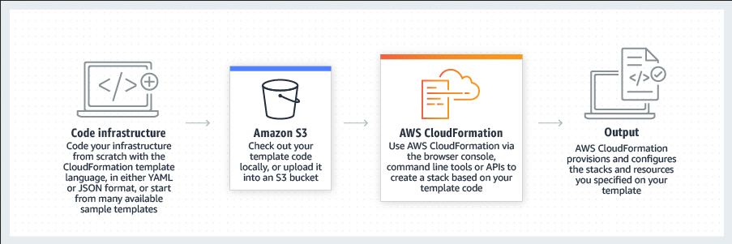

# AWS CloudFormation
Speed up cloud provisioning with `infrastructure as code`

AWS CloudFormation lets you model, provision, and manage AWS and third-party resources by treating infrastructure as code. 


## Use Cases

>### Manage infrastructure with DevOps
>Automate, test, and deploy infrastructure templates with continuous integration and delivery (CI/CD) automations.
>
>### Scale production stacks
>Run anything from a single Amazon Elastic Compute Cloud (EC2) instance to a complex multi-region application.
>
>### Share best practices
>Define an Amazon Virtual Private Cloud (VPC) subnet or provisioning services like AWS OpsWorks or Amazon Elastic Container Service (ECS) with ease.
***

### Simplify infrastructure management

For a scalable web application that also includes a backend database, you might use an Auto Scaling group, an Elastic Load Balancing load balancer, and an Amazon Relational Database Service database instance. You might use each individual service to provision these resources and after you create the resources, you would have to configure them to work together. All these tasks can add complexity and time before you even get your application up and running.

Instead, you can create a CloudFormation template or modify an existing one. A template describes all your resources and their properties. **When you use that template to create a CloudFormation stack, CloudFormation provisions the Auto Scaling group, load balancer, and database for you. After the stack has been successfully created, your AWS resources are up and running. You can delete the stack just as easily, which deletes all the resources in the stack.** By using CloudFormation, you easily manage a collection of resources as a single unit.

### Quickly replicate your infrastructure

If your application requires additional availability, you might replicate it in multiple regions so that if one region becomes unavailable, your users can still use your application in other regions. The challenge in replicating your application is that it also requires you to replicate your resources. Not only do you need to record all the resources that your application requires, but you must also provision and configure those resources in each region.

Reuse your CloudFormation template to create your resources in a consistent and repeatable manner. **To reuse your template, describe your resources once and then provision the same resources over and over in multiple regions**.

### Easily control and track changes to your infrastructure

In some cases, you might have underlying resources that you want to `upgrade` incrementally. For example, you might change to a higher performing instance type in your Auto Scaling launch configuration so that you can reduce the maximum number of instances in your Auto Scaling group. If problems occur after you complete the update, you might need to roll back your infrastructure to the original settings. To do this manually, you not only have to remember which resources were changed, you also have to know what the original settings were.

When you provision your infrastructure with CloudFormation, the CloudFormation template describes exactly what resources are provisioned and their settings. Because these templates are text files, you simply track differences in your templates to track changes to your infrastructure, similar to the way developers control revisions to source code. For example, you can use a `version control system with your templates so that you know exactly what changes were made, who made them, and when`. If at any point you need to reverse changes to your infrastructure, you can use a previous version of your template.

## AWS CloudFormation concepts

When you use AWS CloudFormation, you work with templates and stacks. You create templates to describe your AWS resources and their properties. Whenever you create a stack, CloudFormation provisions the resources that are described in your template.

- Templates
- Stacks
- Change sets

### Templates
***
A CloudFormation template is a JSON or YAML formatted text file. You can save these files with any extension, such as `.json`, `.yaml`, `.template`, or `.txt`. CloudFormation uses these templates as blueprints for building your AWS resources. For example, in a template, you can describe an Amazon EC2 instance, such as the instance type, the AMI ID, block device mappings, and its Amazon EC2 key pair name. Whenever you create a stack, you also specify a template that CloudFormation uses to create whatever you described in the template.

For example, if you created a stack with the following template, CloudFormation provisions an instance with an `ami-0ff8a91507f77f867` AMI ID, `t2.micro` instance type, `testkey` key pair name, and an Amazon EBS volume.


``` yaml
AWSTemplateFormatVersion: 2010-09-09
Description: A sample template
Resources:
  MyEC2Instance:
    Type: 'AWS::EC2::Instance'
    Properties:
      ImageId: ami-0ff8a91507f77f867
      InstanceType: t2.micro
      KeyName: testkey
      BlockDeviceMappings:
        - DeviceName: /dev/sdm
          Ebs:
            VolumeType: io1
            Iops: 200
            DeleteOnTermination: false
            VolumeSize: 20

```
### Stacks
***

When you use CloudFormation, you manage related resources as a single unit called a stack. You create, update, and delete a collection of resources by creating, updating, and deleting stacks. All the resources in a stack are defined by the stack's CloudFormation template. Suppose you created a template that includes an Auto Scaling group, Elastic Load Balancing load balancer, and an Amazon Relational Database Service (Amazon RDS) database instance. To create those resources, you create a stack by submitting the template that you created, and CloudFormation provisions all those resources for you. You can work with stacks by using the CloudFormation console
, API, or [AWS CLI](https://docs.aws.amazon.com/cli/latest/reference/cloudformation/).

### Change sets
***

If you need to make changes to the running resources in a stack, you update the stack. Before making changes to your resources, you can generate a change set, which is a summary of your proposed changes. `Change sets allow you to see how your changes might impact your running resources, especially for critical resources, before implementing them.`

For example, if you change the name of an Amazon RDS database instance, CloudFormation will create a new database and delete the old one. You will lose the data in the old database unless you've already backed it up. If you generate a change set, you will see that your change will cause your database to be replaced, and you will be able to plan accordingly before you update your stack. For more information, see [Updating stacks using change sets](https://docs.aws.amazon.com/AWSCloudFormation/latest/UserGuide/using-cfn-updating-stacks-changesets.html "See image of change set").

## How does AWS CloudFormation work?

When creating a stack, AWS CloudFormation makes underlying service calls to AWS to provision and configure your resources. CloudFormation can only perform actions that you have permission to do. For example, to create EC2 instances by using CloudFormation, you need permissions to create instances. You'll need similar permissions to terminate instances when you delete stacks with instances. You use AWS Identity and Access Management (IAM) to manage permissions.

The calls that CloudFormation makes are all declared by your template. For example, suppose you have a template that describes an EC2 instance with a `t2.micro` instance type. When you use that template to create a stack, CloudFormation calls the Amazon EC2 create instance API and specifies the instance type as `t2.micro`. The following diagram summarizes the CloudFormation workflow for creating stacks.


