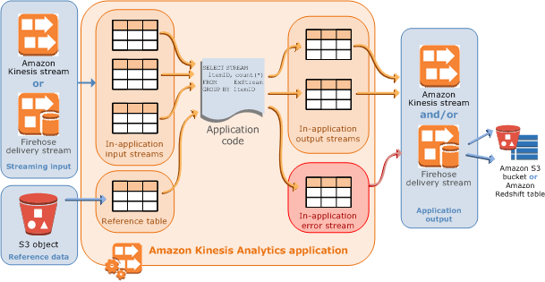
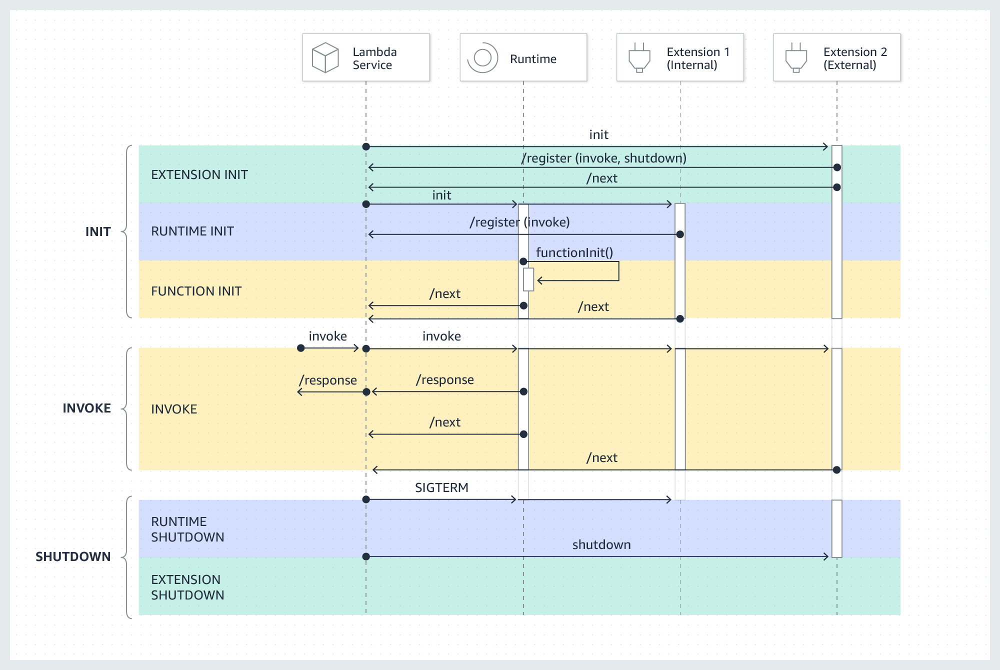

### [SQS](#amazon-simple-queue-service)
### [SNS](#amazon-simple-notification-service)
### [Amazon Kinesis](#amazon-kinesis-1)
### [Lamba](#aws-lambda)

# AWS Integration & Messaging

## Amazon Simple Queue Service
Fully managed message queuing for microservices, distributed systems, and serverless applications

(Message Queuing Service - Amazon Simple Queue Service - AWS)

### Benefits of Amazon Simple Queue Service
**Overhead made simple:** Eliminate overhead with no upfront costs and without needing to manage software or maintain infrastructure. 

**Reliability at scale:** Reliably deliver large volumes of data, at any level of throughput, without losing messages or needing other services to be available.

**Security:** Securely send sensitive data between applications and centrally manage your keys using AWS Key Management. 

**Cost-effective scalability:** Scale elastically and cost-effectively based on usage so you don’t have to worry about capacity planning and preprovisioning. 
***

Amazon Simple Queue Service (Amazon SQS) lets you send, store, and receive messages between software components at any volume, without losing messages or requiring other services to be available.


### Use Cases
**Increase application reliability and scale:**

>Amazon SQS provides a simple and reliable way for customers to decouple and connect components (microservices) together using queues.

**Decouple microservices and process event-driven applications**
> Separate frontend from backend systems, such as in a banking application. Customers immediately get a response, but the bill payments are processed in the background.

**Ensure work is completed cost-effectively and on time**
>Place work in a single queue where multiple workers in an autoscale group scale up and down based on workload and latency requirements.

**Maintain message ordering with deduplication**
> Process messages at high scale while maintaining the message order, allowing you to deduplicate messages.

## Message lifecycle

The following scenario describes the lifecycle of an Amazon SQS message in a queue, from creation to deletion.

1. A producer (component 1) sends message A to a queue, and the message is distributed across the Amazon SQS servers redundantly.
2. When a consumer (component 2) is ready to process messages, it consumes messages from the queue, and message A is returned. While message A is being processed, it remains in the queue and isn't returned to subsequent receive requests for the duration of the [visibility timeout](https://docs.aws.amazon.com/AWSSimpleQueueService/latest/SQSDeveloperGuide/sqs-visibility-timeout.html).
3. The consumer (component 2) deletes message A from the queue to prevent the message from being received and processed again when the visibility timeout expires.

> Note
>
>Amazon SQS automatically deletes messages that have been in a queue for more than the maximum message retention period. The default message retention period is 4 days. However, you can set the message retention period to a value from 60 seconds to 1,209,600 seconds (14 days) using the SetQueueAttributes action.

## Differences between Amazon SQS, Amazon MQ, and Amazon SNS
**Amazon SQS** offers hosted queues that integrate and decouple distributed software systems and components. Amazon SQS provides a generic web services API that you can access using any programming language supported by AWS SDK. Messages in the queue are typically processed by a single subscriber. `Amazon SQS and Amazon SNS `are often used together to create a `fanout messaging application`


**Amazon SNS** is a publish-subscribe service that provides message delivery from publishers (also known as producers) to multiple subscriber endpoints(also known as consumers). Publishers communicate asynchronously with subscribers by sending messages to a topic, which is a logical access point and communication channel. Subscribers can subscribe to an Amazon SNS topic and receive published messages using a supported endpoint type, such as Amazon Kinesis Data Firehose, Amazon SQS, Lambda, HTTP, email, mobile push notifications, and mobile text messages (SMS). Amazon SNS acts as a message router and delivers messages to subscribers in real time. `If a subscriber is not available at the time of message publication, the message is not stored for later retrieval`.

**Amazon MQ** is a managed message `broker service that provides compatibility with industry standard messaging protocols` such as Advanced Message Queueing Protocol (AMQP) and Message Queuing Telemetry Transport (MQTT). Amazon MQ currently supports Apache ActiveMQ
and RabbitMQ engine types. 


| Resource type | Amazon SNS | Amazon SQS | Amazon MQ |
| ------------- | ---------- | ---------- | --------- |
| Synchronous | No | No | Yes |
| Asynchronous | Yes | Yes | Yes |
| Queues | No | Yes | Yes |
| Publisher-subscriber messaging | Yes | No | Yes |
| Message brokers | No | No | Yes |


## Amazon SQS queue types

| Standard queues | FIFO queues |
| --------------- | ----------- |
| **Unlimited Throughput** – Standard queues support a nearly unlimited number of API calls per second, per API action (SendMessage, ReceiveMessage, or DeleteMessage).<br><br> **At-Least-Once Delivery** – A message is delivered at least once, but occasionally more than one copy of a message is delivered.<br><br> **Best-Effort Ordering** – Occasionally, messages are delivered in an order different from which they were sent.| **High Throughput** – If you use batching, FIFO queues support up to 3,000 messages per second, per API method (SendMessageBatch, ReceiveMessage, or DeleteMessageBatch). The 3,000 messages per second represent 300 API calls, each with a batch of 10 messages. To request a quota increase, submit a support request. Without batching, FIFO queues support up to 300 API calls per second, per API method (SendMessage, ReceiveMessage, or DeleteMessage).<br><br> **Exactly-Once Processing** – A message is delivered once and remains available until a consumer processes and deletes it. Duplicates aren't introduced into the queue.<br><br> **First-In-First-Out Delivery** – The order in which messages are sent and received is strictly preserved. |
|  |  |
| Send data between applications when the throughput is important, for example:<br><ul> <li>Decouple live user requests from intensive background work: let users upload media while resizing or encoding it.</li><br><li> Allocate tasks to multiple worker nodes: process a high number of credit card validation requests.</li><br><li>Batch messages for future processing: schedule multiple entries to be added to a database.</li></ul> | Send data between applications when the order of events is important, for example:<br> <ul> <li>Make sure that user-entered commands are run in the right order.</li><br> <li>Display the correct product price by sending price modifications in the right order.</li><br> <li>Prevent a student from enrolling in a course before registering for an account.</li></ul> |

### Use target tracking with the right metric

If you use a target tracking scaling policy based on a custom Amazon SQS queue metric, dynamic scaling can adjust to the demand curve of your application more effectively. 

The issue with using a CloudWatch Amazon SQS metric like `ApproximateNumberOfMessagesVisible` for target tracking is that the number of messages in the queue might not change proportionally to the size of the Auto Scaling group that processes messages from the queue. That's because the number of messages in your SQS queue does not solely define the number of instances needed. The number of instances in your Auto Scaling group can be driven by multiple factors, including how long it takes to process a message and the acceptable amount of latency (queue delay). 


The solution is to use a backlog per instance metric with the target value being the acceptable backlog per instance to maintain. You can calculate these numbers as follows:

- Backlog per instance: To calculate your backlog per instance, start with the `ApproximateNumberOfMessages` queue attribute to determine the length of the SQS queue (number of messages available for retrieval from the queue). Divide that number by the fleet's running capacity, which for an Auto Scaling group is the number of instances in the InService state, to get the backlog per instance.

- Acceptable backlog per instance: To calculate your target value, first determine what your application can accept in terms of latency. Then, take the acceptable latency value and divide it by the average time that an EC2 instance takes to process a message.

The following procedures demonstrate how to publish the custom metric and create the target tracking scaling policy that configures your Auto Scaling group to scale based on these calculations.

> 🔥 Important
>
>Remember, to reduce costs, use metric math instead. For more information, see [Create a target tracking scaling policy for Amazon EC2 Auto Scaling using metric math](https://docs.aws.amazon.com/autoscaling/ec2/userguide/ec2-auto-scaling-target-tracking-metric-math.html).

There are three main parts to this configuration:

- An Auto Scaling group to manage EC2 instances for the purposes of processing messages from an SQS queue.

- A custom metric to send to Amazon CloudWatch that measures the number of messages in the queue per EC2 instance in the Auto Scaling group.

- A target tracking policy that configures your Auto Scaling group to scale based on the custom metric and a set target value. CloudWatch alarms invoke the scaling policy.

The following diagram illustrates the architecture of this configuration. 


### Decouple messaging pattern
This pattern provides asynchronous communication between microservices by using an asynchronous poll model. When the backend system receives a call, it immediately responds with a request identifier and then asynchronously processes the request. <ins>A loosely coupled architecture can be built, which avoids bottlenecks caused by synchronous communication, latency, and input/output operations (IO). In the pattern's use case, Amazon Simple Queue Service (Amazon SQS) and Lambda are used to implement asynchronous communication between different microservices.</ins>

You should consider using this pattern if:

- You want to create loosely coupled architecture.

- All operations don’t need to be completed in a single transaction, and some operations can be asynchronous.

- The downstream system cannot handle the incoming transactions per second (TPS) rate. The messages can be written to the queue and processed based on the availability of resources.

A disadvantage of this pattern is that business transaction actions are synchronous. Even though the calling system receives a response, some part of the transaction might still continue to be processed by downstream systems.

>🔥Important
>
> Because this pattern is more suitable for a fire-and-forget model, the client calling this service should poll the actual service by using a request ID to get the transaction status.

### Use case

In this use case, the insurance system has a sales database that is automatically updated with the customer transaction details after a monthly payment is made. The following illustration shows how to build this system by using the decouple messaging pattern.


The workflow consists of the following steps:

1. The frontend application calls the API Gateway with the payment information after a user makes their monthly payment.

2. The API Gateway runs the “Customer” Lambda function that saves the payment information in an Amazon Aurora database, writes the transaction details in a message to the “Sales" Amazon SQS, and responds to the calling system with a success message.

3. A “Sales” Lambda function pulls the transaction details from the SQS message and updates the sales data. Failure and retry logic to update the sales database is incorporated as part of the “Sales” Lambda function.

### Security in Amazon SQS
- Data protection
- Identity and access management in Amazon SQS
- Logging and monitoring in Amazon SQS
- Compliance validation for Amazon SQS
- Resilience in Amazon SQS
- Infrastructure security in Amazon SQS
- Amazon SQS security best practices


## Basic examples of Amazon SQS policies
### Example 1: Grant one permission to one AWS account

The following example policy grants AWS account number `111122223333` the `SendMessage` permission for the queue named `444455556666/queue1` in the US East (Ohio) region.
``` json
{
   "Version": "2012-10-17",
   "Id": "Queue1_Policy_UUID",
   "Statement": [{
      "Sid":"Queue1_SendMessage",
      "Effect": "Allow",
      "Principal": {
         "AWS": [ 
            "111122223333"
         ]
      },
      "Action": "sqs:SendMessage",
      "Resource": "arn:aws:sqs:us-east-2:444455556666:queue1"
   }]  
}
```
### Grant cross-account permissions to a role and a username

The following example policy grants `role1` and `username1` under AWS account number `111122223333` cross-account permission to use all actions to which Amazon SQS allows shared access for the queue named `123456789012/queue1` in the US East (Ohio) region.

Cross-account permissions don't apply to the following actions:

- `AddPermission`

- `CancelMessageMoveTask`

- `CreateQueue`

- `DeleteQueue`

- `ListMessageMoveTask`

- `ListQueues`

- `ListQueueTags`

- `RemovePermission`

- `SetQueueAttributes`

- `StartMessageMoveTask`

- `TagQueue`

- `UntagQueue`

``` json
{
   "Version": "2012-10-17",
   "Id": "Queue1_Policy_UUID",
   "Statement": [{
      "Sid":"Queue1_AllActions",
      "Effect": "Allow",
      "Principal": {
         "AWS": [
            "arn:aws:iam::111122223333:role/role1",
            "arn:aws:iam::111122223333:user/username1"
         ]
      },
      "Action": "sqs:*",
      "Resource": "arn:aws:sqs:us-east-2:123456789012:queue1"
   }]
}
```
### Amazon SQS visibility timeout
***
When a consumer receives and processes a message from a queue, the message remains in the queue. `Amazon SQS doesn't automatically delete the message`. Because Amazon SQS is a distributed system, there's no guarantee that the consumer actually receives the message (for example, due to a connectivity issue, or due to an issue in the consumer application). Thus, the consumer must delete the message from the queue after receiving and processing it.


Immediately after a message is received, it remains in the queue. `To prevent other consumers from processing the message again, Amazon SQS sets a visibility timeout`, a period of time during which Amazon SQS prevents all consumers from receiving and processing the message. The default visibility timeout for a message is 30 seconds. The minimum is 0 seconds. The maximum is 12 hours. 

>Note
>
>For standard queues, the visibility timeout isn't a guarantee against receiving a message twice. For more information, see At-least-once delivery.
>
>FIFO queues allow the producer or consumer to `attempt multiple retries`:
>
>- If the producer detects a failed SendMessage action, **it can retry sending as many times as necessary**, using the same message deduplication ID. Assuming that the producer receives at least one acknowledgement before the **deduplication interval expires**, multiple <ins>retries neither affect the ordering of messages nor introduce duplicates</ins>.
>
>- If the consumer detects a failed ReceiveMessage action, it can retry as many times as necessary, using the same receive request attempt ID. Assuming that the consumer receives at least one acknowledgement before the visibility timeout expires, multiple retries don't affect the ordering of messages.
>
>- When you receive a message with a message group ID, no more messages for the same message group ID are returned unless you delete the message or it becomes visible.

For most standard queues (depending on queue traffic and message backlog), there can be a maximum of approximately 120,000 in flight messages (received from a queue by a consumer, but not yet deleted from the queue). If you reach this quota while using short polling, Amazon SQS returns the OverLimit error message. If you use long polling, Amazon SQS returns no error messages. To avoid reaching the quota, you should delete messages from the queue after they're processed. You can also increase the number of queues you use to process your messages.

> ! Important
>
> When working with FIFO queues, DeleteMessage operations will fail if the request is received outside of the visibility timeout window. If the visibility timeout is 0 seconds, the message must be deleted within the same millisecond it was sent, or it is considered abandoned. This can cause Amazon SQS to include duplicate messages in the same response to a `ReceiveMessage` operation if the `MaxNumberOfMessages` parameter is greater than 1. 

### Setting the visibility timeout

The visibility timeout begins when Amazon SQS returns a message. During this time, the consumer processes and deletes the message. However, if the consumer fails before deleting the message and your system doesn't call the `DeleteMessage` action for that message before the visibility timeout expires, the message becomes visible to other consumers and the message is received again. If a message must be received only once, your consumer should delete it within the duration of the visibility timeout.

Every Amazon SQS queue has the default visibility timeout setting of 30 seconds. You can change this setting for the entire queue. Typically, you should set the visibility timeout to the maximum time that it takes your application to process and delete a message from the queue. When receiving messages, you can also set a special visibility timeout for the returned messages without changing the overall queue timeout. For more information, see the [best practices in the Processing messages](https://docs.aws.amazon.com/AWSSimpleQueueService/latest/SQSDeveloperGuide/working-with-messages.html#processing-messages-timely-manner) in a timely manner section.

> ! Important
>
>The maximum visibility timeout is 12 hours from the time that Amazon SQS receives the ReceiveMessage request. Extending the visibility timeout does not reset the 12 hour maximum.
>
>it will likely fail (more than 12 hour).
>
> If your consumer needs longer than 12 hours, consider using Step Functions.


### Changing the visibility timeout for a message
You can shorten or extend a message's visibility by specifying a new timeout value using the `ChangeMessageVisibility` action.

For example, if the default timeout for a queue is 60 seconds, 15 seconds have elapsed since you received the message, and you send a `ChangeMessageVisibility` call with `VisibilityTimeout` set to 10 seconds, the 10 seconds begin to count from the time that you make the `ChangeMessageVisibility` call. Thus, any attempt to change the visibility timeout or to delete that message 10 seconds after you initially change the visibility timeout (a total of 25 seconds) might result in an error.

> Note
>
>The new timeout period takes effect from the time you call the ChangeMessageVisibility action. In addition, the new timeout period applies only to the particular receipt of the message. ChangeMessageVisibility doesn't affect the timeout of later receipts of the message or later queues.

### Terminating the visibility timeout for a message

When you receive a message from a queue, you might find that you actually don't want to process and delete that message. Amazon SQS allows you to terminate the visibility timeout for a specific message. This makes the message immediately visible to other components in the system and available for processing.

To terminate a message's visibility timeout after calling ReceiveMessage, call `ChangeMessageVisibility` with `VisibilityTimeout` set to 0 seconds. 

### Consuming messages using long polling

When the wait time for the `ReceiveMessage` API action is greater than 0, long polling is in effect. The maximum long polling wait time is 20 seconds. Long polling helps reduce the cost of using Amazon SQS by eliminating the number of empty responses (when there are no messages available for a `ReceiveMessage` request) and false empty responses (when messages are available but aren't included in a response). For information about enabling long polling for a new or existing queue using the Amazon SQS console, see the [Configuring queue parameters](https://docs.aws.amazon.com/AWSSimpleQueueService/latest/SQSDeveloperGuide/sqs-configure-queue-parameters.html) (console). For best practices, see [Setting up long polling](https://docs.aws.amazon.com/AWSSimpleQueueService/latest/SQSDeveloperGuide/working-with-messages.html#setting-up-long-polling).

Long polling offers the following benefits:

- Reduce empty responses by allowing Amazon SQS to wait until a message is available in a queue before sending a response. Unless the connection times out, the response to the `ReceiveMessage` request contains at least one of the available messages, up to the maximum number of messages specified in the `ReceiveMessage` action. In rare cases, you might receive empty responses even when a queue still contains messages, especially if you specify a low value for the `ReceiveMessageWaitTimeSeconds` parameter.

- Reduce false empty responses by querying all—rather than a subset of—Amazon SQS servers.

- Return messages as soon as they become available.

### Consuming messages using short polling

When you consume messages from a queue using short polling, Amazon SQS samples a subset of its servers (based on a weighted random distribution) and returns messages from only those servers. Thus, a particular `ReceiveMessage` request might not return all of your messages. However, if you have fewer than 1,000 messages in your queue, a subsequent request will return your messages. If you keep consuming from your queues, Amazon SQS samples all of its servers, and you receive all of your messages.

The following diagram shows the short-polling behavior of messages returned from a standard queue after one of your system components makes a receive request. Amazon SQS samples several of its servers (in gray) and returns messages A, C, D, and B from these servers. Message E isn't returned for this request, but is returned for a subsequent (meaning = coming after something in time; following) request.


### Differences between long and short polling

Short polling occurs when the `WaitTimeSeconds` parameter of a `ReceiveMessage` request is set to 0 in one of two ways:

- The `ReceiveMessage` call sets `WaitTimeSeconds` to 0.

- The `ReceiveMessage` call doesn’t set `WaitTimeSeconds`, but the queue attribute `ReceiveMessageWaitTimeSeconds` is set to 0.

## Amazon SQS dead-letter queues
Amazon SQS supports dead-letter queues (DLQ), which other queues (source queues) can target for messages that can't be processed (consumed) successfully. <ins>Dead-letter queues are useful for debugging your application or messaging system because they let you isolate unconsumed messages to determine why their processing didn't succeed.</ins> For information about configuring a dead-letter queue using the Amazon SQS console, see Configuring a dead-letter queue (console). Once you have debugged the consumer application or the consumer application is available to consume the message, you can use the dead-letter queue redrive capability to move the messages back to the source queue.

### How do dead-letter queues work?

Sometimes, messages can't be processed because of a variety of possible issues, such as erroneous conditions within the producer or consumer application or an unexpected state change that causes an issue with your application code. For example, if a user places a web order with a particular product ID, but the product ID is deleted, the web store's code fails and displays an error, and the message with the order request is sent to a dead-letter queue.

Occasionally, producers and consumers might fail to interpret aspects of the protocol that they use to communicate, causing message corruption or loss. Also, the consumer's hardware errors might corrupt message payload.

The redrive policy specifies the source queue, the dead-letter queue, and the conditions under which Amazon SQS moves messages from the former to the latter if the consumer of the source queue fails to process a message a specified number of times. The `maxReceiveCount` is the number of times a consumer tries receiving a message from a queue without deleting it before being moved to the dead-letter queue. Setting the `maxReceiveCount` to a low value such as 1 would result in any failure to receive a message to cause the message to be moved to the dead-letter queue. Such failures include network errors and client dependency errors. To ensure that your system is resilient against errors, set the `maxReceiveCount` high enough to allow for sufficient retries.

<ins>The redrive allow policy specifies which source queues can access the dead-letter queue.</ins> This policy applies to a potential dead-letter queue. You can choose whether to allow all source queues, allow specific source queues, or deny all source queues. The default is to allow all source queues to use the dead-letter queue. If you choose to allow specific queues (using the byQueue option), you can specify up to 10 source queues using the source queue Amazon Resource Name (ARN). If you specify denyAll, the queue cannot be used as a dead-letter queue

>! Important
>
>The dead-letter queue of a FIFO queue must also be a FIFO queue. Similarly, the dead-letter queue of a standard queue must also be a standard queue.
>
>You must use the same AWS account to create the dead-letter queue and the other queues that send messages to the dead-letter queue. Also, dead-letter queues must reside in the same region as the other queues that use the dead-letter queue. For example, if you create a queue in the US East (Ohio) region and you want to use a dead-letter queue with that queue, the second queue must also be in the US East (Ohio) region.
>
>For standard queues, the expiration of a message is always based on its original enqueue timestamp. When a message is moved to a dead-letter queue, the enqueue timestamp is unchanged. The *ApproximateAgeOfOldestMessage* metric indicates when the message moved to the dead-letter queue, not when the message was originally sent. For example, assume that a message spends 1 day in the original queue before it's moved to a dead-letter queue. If the dead-letter queue's retention period is 4 days, the message is deleted from the dead-letter queue after 3 days and the *ApproximateAgeOfOldestMessage* is 3 days. Thus, it is a best practice to always set the retention period of a dead-letter queue to be longer than the retention period of the original queue.
>
>For FIFO queues, the enqueue timestamp resets when the message is moved to a dead-letter queue. The *ApproximateAgeOfOldestMessage* metric indicates when the message moved to the dead-letter queue. In the same example above, the message is deleted from the dead-letter queue after 4 days and the *ApproximateAgeOfOldestMessage* is 4 days

### What are the benefits of dead-letter queues?

The main task of a dead-letter queue is to handle the lifecycle of unconsumed messages. A dead-letter queue lets you set aside and isolate messages that can't be processed correctly to determine why their processing didn't succeed. Setting up a dead-letter queue allows you to do the following:

- Configure an alarm for any messages moved to a dead-letter queue.

- Examine logs for exceptions that might have caused messages to be moved to a dead-letter queue.

- Analyze the contents of messages moved to a dead-letter queue to diagnose software or the producer's or consumer's hardware issues.

- Determine whether you have given your consumer sufficient time to process messages.

### When should I use a dead-letter queue?

✅ Do use dead-letter queues with standard queues. You should always take advantage of dead-letter queues when your applications don't depend on ordering. Dead-letter queues can help you troubleshoot incorrect message transmission operations.
> Note
>
>Even when you use dead-letter queues, you should continue to monitor your queues and retry sending messages that fail for transient reasons.

✅ Do use dead-letter queues to decrease the number of messages and to reduce the possibility of exposing your system to poison-pill messages (messages that can be received but can't be processed).

❌ Don't use a dead-letter queue with standard queues when you want to be able to keep retrying the transmission of a message indefinitely. For example, don't use a dead-letter queue if your program must wait for a dependent process to become active or available.

❌ Don't use a dead-letter queue with a FIFO queue if you don't want to break the exact order of messages or operations. For example, don't use a dead-letter queue with instructions in an Edit Decision List (EDL) for a video editing suite, where changing the order of edits changes the context of subsequent edits.

### Moving messages out of a dead-letter queue

You can use dead-letter queue redrive to manage the lifecycle of unconsumed messages. After you have investigated the attributes and related metadata available for unconsumed messages in a standard or FIFO dead-letter queue, you can redrive the messages back to their source queues. Dead-letter queue redrive reduces API call billing by batching the messages while moving them.

The redrive task uses Amazon SQS's *SendMessageBatch*, *ReceiveMessage*, and *DeleteMessageBatch* APIs on behalf of the user to redrive the messages. Therefore, all redriven messages are considered new messages with a new `messageid`, `enqueueTime`, and retention period. The pricing of dead-letter queue redrive uses the number of API calls invoked and bills based on the Amazon SQS pricing

By default, dead-letter queue redrive moves messages from a dead-letter queue to a source queue. However, you can also configure any other queue as the redrive destination if both queues are the same type. For example, if the dead-letter queue is a FIFO queue, the redrive destination queue must be a FIFO queue as well. Additionally, you can configure the redrive velocity to set the rate at which Amazon SQS moves messages. 

## Amazon SQS temporary queues

Temporary queues help you save development time and deployment costs when using common message patterns such as request-response. You can use the Temporary Queue Client

to create high-throughput, cost-effective, application-managed temporary queues.

The client maps multiple temporary queues—application-managed queues created on demand for a particular process—onto a single Amazon SQS queue automatically. This allows your application to make fewer API calls and have a higher throughput when the traffic to each temporary queue is low. When a temporary queue is no longer in use, the client cleans up the temporary queue automatically, even if some processes that use the client aren't shut down cleanly.

The following are the benefits of temporary queues:

- They serve as lightweight communication channels for specific threads or processes.

- They can be created and deleted without incurring additional cost.

- They are API-compatible with static (normal) Amazon SQS queues. This means that existing code that sends and receives messages can send messages to and receive messages from virtual queues.

### Virtual queues

Virtual queues are local data structures that the Temporary Queue Client creates. Virtual queues let you combine multiple low-traffic destinations into a single Amazon SQS queue. For best practices, see Avoid reusing the [same message group ID with virtual queues](https://docs.aws.amazon.com/AWSSimpleQueueService/latest/SQSDeveloperGuide/using-messagegroupid-property.html#avoiding-reusing-message-group-id-with-virtual-queues).

### Request-response messaging pattern (virtual queues)

The most common use case for temporary queues is the request-response messaging pattern, where a requester creates a temporary queue for receiving each response message. To avoid creating an Amazon SQS queue for each response message, the Temporary Queue Client lets you create and delete multiple temporary queues without making any Amazon SQS API calls.

The following diagram shows a common configuration using this pattern.


## Amazon SQS delay queues
Delay queues let you postpone the delivery of new messages to consumers for a number of seconds, for example, when your consumer application needs additional time to process messages. If you create a delay queue, <ins>any messages that you send to the queue remain invisible to consumers for the duration of the delay period</ins>. The default (minimum) delay for a queue is 0 seconds. The maximum is 15 minutes.


> Note
>
>For standard queues, the per-queue delay setting is not retroactive—changing the setting doesn't affect the delay of messages already in the queue.
>
>For FIFO queues, the per-queue delay setting is retroactive—changing the setting affects the delay of messages already in the queue.

Delay queues are similar to [visibility timeouts](#amazon-sqs-visibility-timeout) because both features make messages unavailable to consumers for a specific period of time. The difference between the two is that, for delay queues, a message is hidden when it is first added to queue, whereas for visibility timeouts a message is hidden only after it is consumed from the queue. The following diagram illustrates the relationship between delay queues and visibility timeouts. 


To set delay seconds on individual messages, rather than on an entire queue, use message timers to allow Amazon SQS to use the message timer's DelaySeconds value instead of the delay queue's DelaySeconds value.


## Managing large Amazon SQS messages using Amazon S3
To manage large Amazon Simple Queue Service (Amazon SQS) messages, you can use Amazon Simple Storage Service (Amazon S3) and the **Amazon SQS Extended Client Library** for Java. This is especially useful for storing and consuming messages up to 2 GB. Unless your application requires repeatedly creating queues and leaving them inactive or storing large amounts of data in your queues, consider using Amazon S3 for storing your data.

You can use the **Amazon SQS Extended Client Library** for Java to do the following:

- Specify whether messages are always stored in Amazon S3 or only when the size of a message exceeds 256 KB

- Send a message that references a single message object stored in an S3 bucket

- Retrieve the message object from an S3 bucket

- Delete the message object from an S3 bucket

You can use the **Amazon SQS Extended Client Library** for Java to manage Amazon SQS messages using Amazon S3 only with the AWS SDK for Java. You can't do this with the AWS CLI, the Amazon SQS console, the Amazon SQS HTTP API, or any of the other AWS SDKs.

## Using the Amazon SQS message deduplication ID
Message deduplication ID is the token used for deduplication of sent messages. If a message with a particular message deduplication ID is sent successfully, any messages sent with the same message deduplication ID are accepted successfully but aren't delivered during the 5-minute deduplication interval.

> Note
>
>Amazon SQS continues to keep track of the message deduplication ID even after the message is received and deleted.

### Providing the message deduplication ID

The producer should provide message deduplication ID values for each message in the following scenarios:

- Messages sent with identical message bodies that Amazon SQS must treat as unique.

- Messages sent with identical content but different message attributes that Amazon SQS must treat as unique.

- Messages sent with different content (for example, retry counts included in the message body) that Amazon SQS must treat as duplicates.

## Using the Amazon SQS message group ID
`MessageGroupId` is the tag that specifies that a message belongs to a specific message group. Messages that belong to the same message group are always processed one by one, in a strict order relative to the message group (however, messages that belong to different message groups might be processed out of order).

## Amazon Simple Notification Service
Fully managed Pub/Sub service for A2A and A2P messaging

or Push Notification service

| Deliver application-to-application (A2A) notifications to integrate and decouple distributed applications. | Distribute application- to-person (A2P) notifications to your customers with SMS texts, push notifications, and email. | Simplify your architecture and reduce costs with message filtering, batching, ordering, and deduplication. | Increase message durability with archiving, replay, delivery retries, and dead-letter queues (DLQs). |
| ------ | ----------- | --------- | ------- |

### How it works

Amazon Simple Notification Service (Amazon SNS) sends notifications two ways, A2A and A2P. A2A provides high-throughput, push-based, many-to-many messaging between distributed systems, microservices, and event-driven serverless applications. These applications include Amazon Simple Queue Service (SQS), Amazon Kinesis Data Firehose, AWS Lambda, and other HTTPS endpoints. A2P functionality lets you send messages to your customers with SMS texts, push notifications, and email. 

pub/ sub


SMS


Mobile Push:


### Use cases
**Integrate your applications with FIFO messaging**
> Deliver messages in a strictly ordered, first in, first out (FIFO) manner to maintain accuracy and consistency across independent applications.

**Securely encrypt notification message delivery**
> Encrypt messages with AWS Key Management Service (KMS), ensure traffic privacy with AWS PrivateLink, and control access with resource policies and tags.

**Capture and fan out events from over 60 AWS services**
> Fan out events across AWS categories, such as analytics, compute, containers, databases, IoT, machine learning (ML), security, and storage.

**Send SMS texts to customers across over 240 countries**
> Use worldwide SMS, with redundancy across providers. Set SMS origination identity with a sender ID, long code, short code, TFN, or 10DLC.

Amazon Simple Notification Service (Amazon SNS) is a managed service that provides message delivery from publishers to subscribers (also known as producers and consumers). Publishers communicate asynchronously with subscribers by sending messages to a topic, which is a logical access point and communication channel. Clients can subscribe to the SNS topic and receive published messages using a supported endpoint type, such as Amazon Kinesis Data Firehose, Amazon SQS, AWS Lambda, HTTP, email, mobile push notifications, and mobile text messages (SMS).


## Features and capabilities
Amazon SNS provides the following features and capabilities:

- **Application-to-application messaging**

   Application-to-application messaging supports subscribers such as Amazon Kinesis Data Firehose delivery streams, Lambda functions, Amazon SQS queues, HTTP/S endpoints, and AWS Event Fork Pipelines. For more information, see Using Amazon SNS for application-to-application (A2A) messaging.

- **Application-to-person notifications**

   Application-to-person notifications provide user notifications to subscribers such as mobile applications, mobile phone numbers, and email addresses. For more information, see Using Amazon SNS for application-to-person (A2P) messaging.

- **Standard and FIFO topics**

   Use a FIFO topic to ensure strict message ordering, to define message groups, and to prevent message duplication. You can use both FIFO and standard queues to subscribe to a FIFO topic. For more information, see Message ordering and deduplication (FIFO topics).

   Use a standard topic when message delivery order and possible message duplication are not critical. All of the supported delivery protocols can subscribe to a standard topic.

- **Message durability**

   Amazon SNS uses a number of strategies that work together to provide message durability (able to withstand wear, pressure, or damage):

   - Published messages are stored across multiple, geographically separated servers and data centers.

    - If a subscribed endpoint isn't available, Amazon SNS runs a delivery retry policy.

   - To preserve any messages that aren't delivered before the delivery retry policy ends, you can create a dead-letter queue.

- **Message archiving, replay, and analytics**

    You can archive messages with Amazon SNS in multiple ways including subscribing Kinesis Data Firehose delivery streams to SNS topics, which allows you to send notifications to analytics endpoints such as Amazon Simple Storage Service (Amazon S3) buckets, Amazon Redshift tables, and more. Additionally, Amazon SNS FIFO topics support message archiving and replay as a no-code, in-place message archive that lets topic owners store (or archive) messages within their topic. Topic subscribers can then retrieve (or replay) the archived messages back to a subscribed endpoint. For more, see Message archiving and replay for FIFO topics.

- Message attributes

    Message attributes let you provide any arbitrary metadata about the message. Amazon SNS message attributes.

- Message filtering

    By default, each subscriber receives every message published to the topic. To receive a subset of the messages, a subscriber must assign a filter policy to the topic subscription. A subscriber can also define the filter policy scope to enable payload-based or attribute-based filtering. The default value for the filter policy scope is `MessageAttributes`. When the incoming message attributes match the filter policy attributes, the message is delivered to the subscribed endpoint. Otherwise, the message is filtered out. When the filter policy scope is `MessageBody`, filter policy attributes are matched against the payload. For more information, see Amazon SNS message filtering.

- Message security

    Server-side encryption protects the contents of messages that are stored in Amazon SNS topics, using encryption keys provided by AWS KMS. For more information, see Encryption at rest.

    You can also establish a private connection between Amazon SNS and your virtual private cloud (VPC). for more information, see Internetwork traffic privacy.

## Common Amazon SNS scenarios
### Application integration

The Fanout scenario is when a message published to an SNS topic is replicated and pushed to multiple endpoints, such as Kinesis Data Firehose delivery streams, Amazon SQS queues, HTTP(S) endpoints, and Lambda functions. This allows for parallel asynchronous processing.

For example, you can develop an application that publishes a message to an SNS topic whenever an order is placed for a product. Then, SQS queues that are subscribed to the SNS topic receive identical notifications for the new order. An Amazon Elastic Compute Cloud (Amazon EC2) server instance attached to one of the SQS queues can handle the processing or fulfillment of the order. And you can attach another Amazon EC2 server instance to a data warehouse for analysis of all orders received.


You can also use fanout to replicate data sent to your production environment with your test environment. Expanding upon the previous example, you can subscribe another SQS queue to the same SNS topic for new incoming orders. Then, by attaching this new SQS queue to your test environment, you can continue to improve and test your application using data received from your production environment.

> ! Important
> 
>Make sure that you consider data privacy and security before you send any production data to your test environment.


- [Fanout to Kinesis Data Firehose delivery streams](https://docs.aws.amazon.com/sns/latest/dg/sns-firehose-as-subscriber.html)

- [Fanout to Lambda functions](https://docs.aws.amazon.com/sns/latest/dg/sns-lambda-as-subscriber.html)

- [Fanout to Amazon SQS queues](https://docs.aws.amazon.com/sns/latest/dg/sns-sqs-as-subscriber.html)

- [Fanout to HTTP(S) endpoints](https://docs.aws.amazon.com/sns/latest/dg/sns-http-https-endpoint-as-subscriber.html)

- [Event-Driven Computing with Amazon SNS and AWS Compute, Storage, Database, and Networking Services](https://aws.amazon.com/blogs/compute/event-driven-computing-with-amazon-sns-compute-storage-database-and-networking-services/)

### Application alerts

Application and system alerts are notifications that are triggered by predefined thresholds. Amazon SNS can send these notifications to specified users via SMS and email. For example, you can receive immediate notification when an event occurs, such as a specific change to your Amazon EC2 Auto Scaling group, a new file uploaded to an Amazon S3 bucket, or a metric threshold breached in Amazon CloudWatch. For more information, see [Setting up Amazon SNS notifications](https://docs.aws.amazon.com/AmazonCloudWatch/latest/monitoring/US_SetupSNS.html) in the Amazon CloudWatch User Guide.

### User notifications

Amazon SNS can send push email messages and text messages (SMS messages) to individuals or groups. For example, you could send e-commerce order confirmations as user notifications. For more information about using Amazon SNS to send SMS messages, see [Mobile text messaging (SMS)](https://docs.aws.amazon.com/sns/latest/dg/sns-mobile-phone-number-as-subscriber.html).

### Mobile push notifications

Mobile push notifications enable you to send messages directly to mobile apps. For example, you can use Amazon SNS to send update notifications to an app. The notification message can include a link to download and install the update. For more information about using Amazon SNS to send push notification messages, see [Mobile push notifications.](https://docs.aws.amazon.com/sns/latest/dg/sns-mobile-application-as-subscriber.html)

## Message ordering and deduplication (FIFO topics)
You can use Amazon SNS FIFO (first in, first out) topics with Amazon SQS FIFO queues to provide strict message ordering and message deduplication. The FIFO capabilities of each of these services work together to act as a fully managed service to integrate distributed applications that require data consistency in near-real time. Subscribing Amazon SQS standard queues to Amazon SNS FIFO topics provides best-effort ordering and at least once delivery

## FIFO topics example use case

The following example describes an ecommerce platform built by an auto parts manufacturer using Amazon SNS FIFO topics and Amazon SQS queues. The platform is composed of four serverless applications:

- Inventory managers use a price management application to set the price for each item in stock. At this company, product prices can change based on currency exchange fluctuation, market demand, and shifts in sales strategy. The price management application uses an AWS Lambda function that publishes price updates to an Amazon SNS FIFO topic whenever prices change.

- A wholesale application provides the backend for a website where auto body shops and car manufacturers can buy the company's auto parts in bulk. To get price change notifications, the wholesale application subscribes its Amazon SQS FIFO queue to the price management application's Amazon SNS FIFO topic.

- A retail application provides the backend for another website where car owners and car tuning enthusiasts can purchase individual auto parts for their vehicles. To get price change notifications, the retail application also subscribes its Amazon SQS FIFO queue to the price management application's Amazon SNS FIFO topic.

- An analytics application that aggregates price updates and stores them into an Amazon S3 bucket, enabling Amazon Athena to query the bucket for business intelligence (BI) purposes. To get price change notifications, the analytics application subscribes its Amazon SQS standard queue to the price management application's Amazon SNS FIFO topic. Unlike the other applications, the analytics one doesn't require the price updates to be strictly ordered.


For the wholesale and retail applications to receive price updates in the correct order, the price management application must use a strictly ordered message distribution system. Using Amazon SNS FIFO topics and Amazon SQS FIFO queues enables the processing of messages in order and with no duplication.

## Amazon SNS message filtering
By default, an Amazon SNS topic subscriber receives every message that's published to the topic. To receive only a subset of the messages, a subscriber must assign a filter policy to the topic subscription.

A filter policy is a JSON object containing properties that define which messages the subscriber receives. Amazon SNS supports policies that act on the message attributes (name, type (String, String.Array, Number, and binary), value) or on the message body, according to the filter policy scope that you set for the subscription. Filter policies for the message body assume that the message payload is a well-formed JSON object.

If a subscription doesn't have a filter policy, the subscriber receives every message published to its topic. When you publish a message to a topic with a filter policy in place, Amazon SNS compares the message attributes or the message body to the properties in the filter policy for each of the topic's subscriptions. If any of the message attributes or message body properties match, Amazon SNS sends the message to the subscriber. Otherwise, Amazon SNS doesn't send the message to that subscriber.

For more information, see [Filter Messages Published to Topics](https://aws.amazon.com/tutorials/filter-messages-published-to-topics/)

## Amazon Kinesis
Collect, process, and analyze real-time video and data streams

| Ingest, buffer, and process streaming data in real time to derive insights in minutes, not days.| Run your streaming applications on serverless infrastructure with a fully managed service. | Handle any amount of streaming data from thousands of sources and process it with low latencies. |
| ---------- | ------------ | -------------- |

ingest = take

### How it works

Amazon Kinesis cost-effectively processes and analyzes streaming data at any scale as a fully managed service. With Kinesis, you can ingest real-time data, such as video, audio, application logs, website clickstreams, and IoT telemetry data, for machine learning (ML), analytics, and other applications.

**Kinesis Data streams**

Amazon Kinesis Data Streams is a serverless streaming data service that simplifies the capture, processing, and storage of data streams at any scale


**Kinesis Data Firehose**

Amazon Kinesis Data Firehose is an extract, transform, and load (ETL) service that reliably captures, transforms, and delivers streaming data to data lakes, data stores, and analytics services. 


**Kinesis Video Streams**

With Amazon Kinesis Video Streams, you can more easily and securely stream video from connected devices to AWS for analytics, ML, playback, and other processing.


### Use cases

**Create real-time applications**
> Build apps for application monitoring, fraud detection, and live leaderboards. Analyze data and emit the results to any data store or application.

**Evolve from batch to real-time analytics**
> Perform real-time analytics on data that has been traditionally analyzed using batch processing. Get the latest information without delay.

**Analyze IoT device data**
> Process streaming data from IoT devices, and then use the data to programmatically send real-time alerts and respond when a sensor exceeds certain operating thresholds.

**Build video analytics applications**
> Securely stream video from camera-equipped devices. Use streams for video playback, security monitoring, face detection, ML, and other analytics

## What Can I Do with Kinesis Data Streams?

You can use Kinesis Data Streams for rapid and continuous data intake and aggregation. The type of data used can include IT infrastructure log data, application logs, social media, market data feeds, and web clickstream data. Because the response time for the data intake and processing is in real time, the processing is typically lightweight.

The following are typical scenarios for using Kinesis Data Streams:

Accelerated log and data feed intake and processing

   > You can have producers push data directly into a stream. For example, push system and application logs and they are available for processing in seconds. This prevents the log data from being lost if the front end or application server fails. Kinesis Data Streams provides accelerated data feed intake because you don't batch the data on the servers before you submit it for intake.

Real-time metrics and reporting

   >You can use data collected into Kinesis Data Streams for simple data analysis and reporting in real time. For example, your data-processing application can work on metrics and reporting for system and application logs as the data is streaming in, rather than wait to receive batches of data.

Real-time data analytics

   >This combines the power of parallel processing with the value of real-time data. For example, process website clickstreams in real time, and then analyze site usability engagement using multiple different Kinesis Data Streams applications running in parallel.

Complex stream processing

   >You can create Directed Acyclic Graphs (DAGs) of Kinesis Data Streams applications and data streams. This typically involves putting data from multiple Kinesis Data Streams applications into another stream for downstream processing by a different Kinesis Data Streams application.


## Amazon Kinesis Data Streams Terminology and Concepts

- Kinesis Data Streams High-Level Architecture
- Kinesis Data Streams Terminology

### Kinesis Data Streams High-Level Architecture

The following diagram illustrates the high-level architecture of Kinesis Data Streams. The producers continually push data to Kinesis Data Streams, and the consumers process the data in real time. Consumers (such as a custom application running on Amazon EC2 or an Amazon Kinesis Data Firehose delivery stream) can store their results using an AWS service such as Amazon DynamoDB, Amazon Redshift, or Amazon S3. 


### Kinesis Data Streams Terminology
### Kinesis Data Stream

A Kinesis data stream is a set of [shards](#shard). Each shard has a sequence of data records. Each data record has a sequence number that is assigned by Kinesis Data Streams

### Data Record

A data record is the unit of data stored in a Kinesis data stream. Data records are composed of a sequence number, a partition key, and a data blob, which is an immutable sequence of bytes. Kinesis Data Streams does not inspect, interpret, or change the data in the blob in any way. A data blob can be up to 1 MB.
### Capacity Mode

A data stream capacity mode determines how capacity is managed and how you are charged for the usage of your data stream. Currenly, in Kinesis Data Streams, you can choose between an **on-demand** mode and a **provisioned** mode for your data streams. For more information, see Choosing the Data Stream Capacity Mode.

With the **on-demand** mode, Kinesis Data Streams <ins>automatically manages the shards in order to provide the necessary throughput. You are charged only for the actual throughput that you use and Kinesis Data Streams automatically accommodates your workloads’ throughput needs as they ramp up or down.</ins> For more information, see On-demand Mode.

With the **provisioned** mode, <ins>you must specify the number of shards for the data stream. The total capacity of a data stream is the sum of the capacities of its shards.</ins> You can increase or decrease the number of shards in a data stream as needed and you are charged for the number of shards at an hourly rate. For more information, see Provisioned Mode.
### Retention Period

The retention period is the length of time that data records are accessible after they are added to the stream. A stream’s retention period is set to a default of 24 hours after creation. You can increase the retention period up to 8760 hours (365 days) using the *IncreaseStreamRetentionPeriod* operation, and decrease the retention period down to a minimum of 24 hours using the *DecreaseStreamRetentionPeriod* operation. Additional charges apply for streams with a retention period set to more than 24 hours. For more information, see Amazon Kinesis Data Streams Pricing


### Producer

Producers put records into Amazon Kinesis Data Streams. For example, a web server sending log data to a stream is a producer.
### Consumer

Consumers get records from Amazon Kinesis Data Streams and process them. These consumers are known as Amazon Kinesis Data Streams Application.
### Amazon Kinesis Data Streams Application

An Amazon Kinesis Data Streams application is a consumer of a stream that commonly runs on a fleet of EC2 instances.

There are two types of consumers that you can develop: shared fan-out consumers and enhanced fan-out consumers. To learn about the differences between them, and to see how you can create each type of consumer, see *Reading Data from Amazon Kinesis Data Streams*.

The output of a Kinesis Data Streams application can be input for another stream, enabling you to create complex topologies that process data in real time. An application can also send data to a variety of other AWS services. There can be multiple applications for one stream, and each application can consume data from the stream independently and concurrently.
### Shard

A shard is a uniquely identified sequence of data records in a stream. A stream is composed of one or more shards, each of which provides a fixed unit of capacity. Each shard can support up to 5 transactions per second for reads, up to a maximum total data read rate of 2 MB per second and up to 1,000 records per second for writes, up to a maximum total data write rate of 1 MB per second (including partition keys). The data capacity of your stream is a function of the number of shards that you specify for the stream. The total capacity of the stream is the sum of the capacities of its shards.

If your data rate increases, you can increase or decrease the number of shards allocated to your stream. For more information, see Resharding a Stream.
### Partition Key

A partition key is used to group data by shard within a stream. Kinesis Data Streams segregates the data records belonging to a stream into multiple shards. It uses the partition key that is associated with each data record to determine which shard a given data record belongs to. Partition keys are Unicode strings, with a maximum length limit of 256 characters for each key. An MD5 hash function is used to map partition keys to 128-bit integer values and to map associated data records to shards using the hash key ranges of the shards. When an application puts data into a stream, it must specify a partition key.
### Sequence Number

Each data record has a sequence number that is unique per partition-key within its shard. Kinesis Data Streams assigns the sequence number after you write to the stream with `client.putRecords` or `client.putRecord`. Sequence numbers for the same partition key generally increase over time. <ins>The longer the time period between write requests, the larger the sequence numbers become.</ins>
>Note
>
>Sequence numbers cannot be used as indexes to sets of data within the same stream. To logically separate sets of data, use partition keys or create a separate stream for each dataset.

### Kinesis Client Library

The Kinesis Client Library is compiled into your application to enable fault-tolerant consumption of data from the stream. The Kinesis Client Library ensures that for every shard there is a <ins>record processor</ins> running and processing that shard. The library also <ins>simplifies reading data </ins>from the stream. `The Kinesis Client Library uses an Amazon DynamoDB table to store control data.` It creates one table per application that is processing data.

There are two major versions of the Kinesis Client Library. Which one you use depends on the type of consumer you want to create. For more information, see Reading Data from Amazon Kinesis Data Streams.
### Application Name

The name of an Amazon Kinesis Data Streams application identifies the application. Each of your applications must have a unique name that is scoped to the AWS account and Region used by the application. `This name is used as a name for the control table in Amazon DynamoDB and the namespace for Amazon CloudWatch metrics`.
### Server-Side Encryption

Amazon Kinesis Data Streams can automatically encrypt sensitive data as a producer enters it into a stream. Kinesis Data Streams uses AWS KMS master keys for encryption. For more information, see Data Protection in Amazon Kinesis Data Streams.

## Creating and Managing Streams
Amazon Kinesis Data Streams ingests a large amount of data in real time, durably stores the data, and makes the data available for consumption. The unit of data stored by Kinesis Data Streams is a data record. A data stream represents a group of data records. The data records in a data stream are distributed into shards.

A shard has a sequence of data records in a stream. It serves as a base throughput unit of a Kinesis data stream. A shard supports 1 MB/s and 1000 records per second for writes and 2 MB/s for reads in both on-demand and provisioned capacity modes. The shard limits ensure predictable performance, making it easier to design and operate a highly reliable data streaming workflow. 

## Choosing the Data Stream Capacity Mode
### What is a Data Stream Capacity Mode?

A capacity mode determines how the capacity of a data stream is managed and how you are charged for the usage of your data stream. In Amazon Kinesis Data Streams, you can choose between an on-demand mode and a provisioned mode for your data streams. 

### On-demand Mode

Data streams in the on-demand mode require no capacity planning and automatically scale to handle gigabytes of write and read throughput per minute. On-demand mode simplifies ingesting and storing large data volumes at a low-latency because <ins>it eliminates provisioning and managing servers, storage, or throughput. You can ingest billions of records per day without any operational overhead.</ins>

On-demand mode is ideal for addressing the needs of highly variable and unpredictable application traffic. You no longer have to provision these workloads for peak capacity, which can result in higher costs due to low utilization. On-demand mode is suited for workloads with unpredictable and highly-variable traffic patterns.

With the on-demand capacity mode, you pay per GB of data written and read from your data streams. You do not need to specify how much read and write throughput you expect your application to perform. Kinesis Data Streams instantly accommodates your workloads as they ramp up or down.

You can create a new data stream with the on-demand mode by using the Kinesis Data Streams console, APIs, or CLI commands.

A data stream in the on-demand mode accommodates up to double the peak write throughput observed in the previous 30 days. As your data stream’s write throughput reaches a new peak, Kinesis Data Streams scales the data stream’s capacity automatically. For example, if your data stream has a write throughput that varies between 10 MB/s and 40 MB/s, then Kinesis Data Streams ensures that you can easily burst to double your previous peak throughput, or 80 MB/s. If the same data stream sustains a new peak throughput of 50 MB/s, Kinesis Data Streams ensures that there is enough capacity to ingest 100 MB/s of write throughput. However, write throttling can occur if your traffic increases to more than double the previous peak within a 15-minute duration. You need to retry these throttled requests.

The aggregate read capacity of a data stream with the on-demand mode increases proportionally to write throughput. This helps to ensure that consumer applications always have adequate read throughput to process incoming data in real time. You get at least twice the write throughput compared to read data using the `GetRecords` API. We recommend that you use one consumer application with the `GetRecord` API, so that it has enough room to catch up when the application needs to recover from downtime. It is recommended that you use the Enhanced Fan-Out capability of Kinesis Data Streams for scenarios that require adding more than one consumer application. Enhanced Fan-Out supports adding up to 20 consumer applications to a data stream using the `SubscribeToShard` API, with each consumer application having dedicated throughput. 

### Handling Read and Write Throughput Exceptions

With the on-demand capacity mode (same as with the provisioned capacity mode), you must specify a partition key with each record to write data into your data stream. Kinesis Data Streams uses your partition keys to distribute data across shards. Kinesis Data Streams monitors traffic for each shard. When the incoming traffic exceeds 500 KB/s per shard, it splits the shard within 15 minutes. The parent shard’s hash key values are redistributed evenly across child shards.

If your incoming traffic exceeds twice your prior peak, you can experience read or write exceptions for about 15 minutes, even when your data is distributed evenly across the shards. We recommend that you retry all such requests so that all the records are properly stored in Kinesis Data Streams.

**You may experience read and write exceptions if you are using a partition key that leads to uneven data distribution, and the records assigned to a particular shard exceed its limits**. With on-demand mode, the data stream automatically adapts to handle uneven data distribution patterns unless a single partition key exceeds a shard’s 1 MB/s throughput and 1000 records per second limits.

In the on-demand mode, Kinesis Data Streams splits the shards evenly when it detects an increase in traffic. However, it does not detect and isolate hash keys that are driving a higher portion of incoming traffic to a particular shard. `If you are using highly uneven partition keys you may continue to receive write exceptions. For such use cases, we recommend that you use the provisioned capacity mode that supports granular shard splits`.

### Provisioned Mode

With provisioned mode, after you create the data stream, you can dynamically scale your shard capacity up or down using the AWS Management Console or the UpdateShardCount API. You can make updates while there is a Kinesis Data Streams producer or consumer application writing to or reading data from the stream.

The provisioned mode is suited for predictable traffic with capacity requirements that are easy to forecast. You can use the provisioned mode if you want fine-grained control over how data is distributed across shards.

With the provisioned mode, you must specify the number of shards for the data stream. To determine the size of a data stream with the provisioned mode, you need the following input values:

- The average size of the data record written to the stream in kilobytes (KB), rounded up to the nearest 1 KB (`average_data_size_in_KB`).

- The number of data records written to and read from the stream per second (`records_per_second`).

- The number of consumers, which are Kinesis Data Streams applications that consume data concurrently and independently from the stream (`number_of_consumers`).

- The incoming write bandwidth in KB (`incoming_write_bandwidth_in_KB`), which is equal to the `average_data_size_in_KB` multiplied by the `records_per_second`.

- The outgoing read bandwidth in KB (`outgoing_read_bandwidth_in_KB`), which is equal to the `incoming_write_bandwidth_in_KB` multiplied by the number_of_consumers.

You can calculate the number of shards (number_of_shards) that your stream needs by using the input values in the following formula.

```
number_of_shards = max(incoming_write_bandwidth_in_KiB/1024, outgoing_read_bandwidth_in_KiB/2048)
```
You may still experience read and write throughput exceptions in the provisioned mode if you don't configure your data stream to handle your peak throughput. In this case, you must manually scale your data stream to accommodate your data traffic.

You may also experience read and write exceptions <ins>if you're using a partition key that leads to uneven data distribution and the records assigned to a shard exceed its limits. To resolve this issue in the provisioned mode, identify such shards and manually split them to better accommodate your traffic.</ins>

### Switching Between Capacity Modes

You can switch the capacity mode of your data stream from on-demand to provisioned, or from provisioned to on-demand. For each data stream in your AWS account, you can switch between the on-demand and provisioned capacity modes twice within 24 hours.

Switching between capacity modes of a data stream does not cause any disruptions to your applications that use this data stream. You can continue writing to and reading from this data stream. As you are switching between capacity modes, either from on-demand to provisioned or from provisioned to on-demand, the status of the stream is set to Updating. You must wait for the data stream status to get to Active before you can modify its properties again.

When you switch from provisioned to on-demand capacity mode, your data stream initially retains whatever shard count it had before the transition, and from this point on, Kinesis Data Streams monitors your data traffic and scales the shard count of this on-demand data stream depending on your write throughput.

When you switch from on-demand to provisioned mode, your data stream also initially retains whatever shard count it had before the transition, but from this point on, you are responsible for monitoring and adjusting the shard count of this data stream to properly accomodate your write throughput.

## Writing Data to Amazon Kinesis Data Streams
A producer is an application that writes data to Amazon Kinesis Data Streams. You can build producers for Kinesis Data Streams using the AWS SDK for Java and the Kinesis Producer Library.

To put data into the stream, you must specify the name of the stream, a partition key, and the data blob to be added to the stream. The partition key is used to determine which shard in the stream the data record is added to.

All the data in the shard is sent to the same worker that is processing the shard. Which partition key you use depends on your application logic. The number of partition keys should typically be much greater than the number of shards. This is because the partition key is used to determine how to map a data record to a particular shard. If you have enough partition keys, the data can be evenly distributed across the shards in a stream.

### Developing Producers Using the Amazon Kinesis Producer Library
An Amazon Kinesis Data Streams producer is an application that puts user data records into a Kinesis data stream (also called data ingestion). The Kinesis Producer Library (KPL) simplifies producer application development, allowing developers to achieve high write throughput to a Kinesis data stream.

You can monitor the KPL with Amazon CloudWatch. 

### Role of the KPL

The KPL is an easy-to-use, highly configurable library that helps you write to a Kinesis data stream. It acts as an intermediary between your producer application code and the Kinesis Data Streams API actions. The KPL performs the following primary tasks:

- Writes to one or more Kinesis data streams with an automatic and configurable retry mechanism

- Collects records and uses `PutRecords` to write multiple records to multiple shards per request

- [Aggregates](## "a whole formed by combining several separate elements") user records to increase payload size and improve throughput

- [Integrates](### "combine (one thing) with another to form a whole.") seamlessly with the Kinesis Client Library (KCL) to de-aggregate batched records on the consumer

- Submits Amazon CloudWatch metrics on your behalf to provide visibility into producer performance

Note that the KPL is different from the Kinesis Data Streams API that is available in the AWS SDKs
. The Kinesis Data Streams API helps you manage many aspects of Kinesis Data Streams (including creating streams, resharding, and putting and getting records), while the KPL provides a layer of abstraction specifically for ingesting data. 

###When Not to Use the KPL

The KPL can incur an additional processing delay of up to `RecordMaxBufferedTime` within the library (user-configurable). Larger values of `RecordMaxBufferedTime` results in higher packing efficiencies and better performance. Applications that cannot tolerate this additional delay may need to use the AWS SDK directly.

## Reading Data from Amazon Kinesis Data Streams
A consumer is an application that processes all data from a Kinesis data stream. When a consumer uses enhanced fan-out, it gets its own 2 MB/sec allotment of read throughput, allowing multiple consumers to read data from the same stream in parallel, without contending for read throughput with other consumers. To use the enhanced fan-out capability of shards, see Developing Custom Consumers with Dedicated Throughput (Enhanced Fan-Out).

By default, shards in a stream provide 2 MB/sec of read throughput per shard. This throughput gets shared across all the consumers that are reading from a given shard. In other words, the default 2 MB/sec of throughput per shard is fixed, even if there are multiple consumers that are reading from the shard. To use this default throughput of shards see, *Developing Custom Consumers with Shared Throughput.*

The following table compares default throughput to enhanced fan-out. Message propagation delay is defined as the time taken in milliseconds for a payload sent using the payload-dispatching APIs (like PutRecord and PutRecords) to reach the consumer application through the payload-consuming APIs (like GetRecords and SubscribeToShard). 

| Characteristics | Unregistered Consumers without Enhanced Fan-Out | Registered Consumers with Enhanced Fan-Out |
| ---- | ----- | ----- |
| Shard Read Throughput | Fixed at a total of 2 MB/sec per shard. If there are multiple consumers reading from the same shard, they all share this throughput. <ins>The sum of the throughputs they receive from the shard doesn't exceed 2 MB/sec.</ins> | Scales as consumers register to use enhanced fan-out. Each consumer registered to <ins>use enhanced fan-out receives its own read throughput per shard, up to 2 MB/sec, independently of other consumers.</ins> |
| Message propagation delay | An average of around 200 ms if you have one consumer reading from the stream. This average goes up to around 1000 ms if you have five consumers.| Typically an average of 70 ms whether you have one consumer or five consumers. |
| Cost | N/A | There is a data retrieval cost and a consumer-shard hour cost. For more information, see Amazon Kinesis Data Streams Pricing. |
| Record delivery model | Pull model over HTTP using GetRecords.| Kinesis Data Streams pushes the records to you over HTTP/2 using SubscribeToShard. | 

## Developing Consumers Using AWS Lambda

You can use an AWS Lambda function to process records in a data stream. AWS Lambda is a compute service that lets you run code without provisioning or managing servers. It executes your code only when needed and scales automatically, from a few requests per day to thousands per second. You pay only for the compute time you consume. There is no charge when your code is not running. With AWS Lambda, you can run code for virtually any type of application or backend service, all with zero administration. It runs your code on a high-availability compute infrastructure and performs all of the administration of the compute resources, including server and operating system maintenance, capacity provisioning and automatic scaling, code monitoring and logging.

## Developing Consumers Using Amazon Kinesis Data Firehose

You can use a Kinesis Data Firehose to read and process records from a Kinesis stream. Kinesis Data Firehose is a fully managed service for delivering real-time streaming data to destinations such as Amazon S3, Amazon Redshift, Amazon OpenSearch Service, and Splunk. Kinesis Data Firehose also supports any custom HTTP endpoint or HTTP endpoints owned by supported third-party service providers, including Datadog, MongoDB, and New Relic. You can also configure Kinesis Data Firehose to transform your data records and to convert the record format before delivering your data to its destination.


## Using the Kinesis Client Library
One of the methods of developing custom consumer applications that can process data from KDS data streams is to use the Kinesis Client Library (KCL).

### What is the Kinesis Client Library?

KCL helps you consume and process data from a Kinesis data stream by taking care of many of the complex tasks associated with distributed computing. These include load balancing across multiple consumer application instances, responding to consumer application instance failures, checkpointing processed records, and reacting to resharding. The KCL takes care of all of these subtasks so that you can focus your efforts on writing your custom record-processing logic.

The KCL is different from the Kinesis Data Streams APIs that are available in the AWS SDKs. The Kinesis Data Streams APIs help you manage many aspects of Kinesis Data Streams, including creating streams, resharding, and putting and getting records. The KCL provides a layer of abstraction around all these subtasks, specifically so that you can focus on your consumer application’s custom data processing logic.

The KCL acts as an intermediary between your record processing logic and Kinesis Data Streams. The KCL performs the following tasks:

- Connects to the data stream

- Enumerates the shards within the data stream

- Uses leases to coordinates shard associations with its workers

- Instantiates a record processor for every shard it manages

- Pulls data records from the data stream

- Pushes the records to the corresponding record processor

- Checkpoints processed records

- Balances shard-worker associations (leases) when the worker instance count changes or when the data stream is resharded (shards are split or merged)


### KCL Concepts

- **KCL consumer application** – an application that is custom-built using KCL and designed to read and process records from data streams.

- **Consumer application instance** - KCL consumer applications are typically distributed, with one or more application instances running simultaneously in order to coordinate on failures and dynamically load balance data record processing.

- **Worker** – a high level class that a KCL consumer application instance uses to start processing data. 

> ! Important
>
>Each KCL consumer application instance has one worker. 

   The worker initializes and oversees various tasks, including syncing shard and lease information, tracking shard assignments, and processing data from the shards. A worker provides KCL with the configuration information for the consumer application, such as the name of the data stream whose data records this KCL consumer application is going to process and the AWS credentials that are needed to access this data stream. The worker also kick starts that specific KCL consumer application instance to deliver data records from the data stream to the record processors.

- **Lease** – data that defines the binding between a worker and a shard. Distributed KCL consumer applications use leases to partition data record processing across a fleet of workers. At any given time, each shard of data records is bound to a particular worker by a lease identified by the `leaseKey` variable.

   By default, a worker can hold one or more leases (subject to the value of the maxLeasesForWorker variable) at the same time. 

- **Lease table** - a unique Amazon DynamoDB table that is used to keep track of the shards in a KDS data stream that are being leased and processed by the workers of the KCL consumer application. The lease table must remain in sync (within a worker and across all workers) with the latest shard information from the data stream while the KCL consumer application is running.

- **Record processor** – the logic that defines how your KCL consumer application processes the data that it gets from the data streams. At runtime, a KCL consumer application instance instantiates a worker, and this worker instantiates one record processor for every shard to which it holds a lease. 

## Splitting a Shard
To split a shard in Amazon Kinesis Data Streams, you need to specify how hash key values from the parent shard should be redistributed to the child shards. When you add a data record to a stream, it is assigned to a shard based on a hash key value. The hash key value is the MD5 hash of the partition key that you specify for the data record at the time that you add the data record to the stream. Data records that have the same partition key also have the same hash key value.

When you split the shard, you specify a value in this range. That hash key value and all higher hash key values are distributed to one of the child shards. All the lower hash key values are distributed to the other child shard.

The following code demonstrates a shard split operation that redistributes the hash keys evenly between each of the child shards, essentially splitting the parent shard in half. This is just one possible way of dividing the parent shard. You could, for example, split the shard so that the lower one-third of the keys from the parent go to one child shard and the upper two-thirds of the keys go to the other child shard. However, for many applications, splitting shards in half is an effective approach.

The code assumes that `myStreamName` holds the name of your stream and the object variable shard holds the shard to split. Begin by instantiating a new `splitShardRequest` object and setting the stream name and shard ID.

``` java
SplitShardRequest splitShardRequest = new SplitShardRequest();
splitShardRequest.setStreamName(myStreamName);
splitShardRequest.setShardToSplit(shard.getShardId());
```
## Merging Two Shards

 A shard merge operation takes two specified shards and combines them into a single shard. After the merge, the single child shard receives data for all hash key values covered by the two parent shards.
Shard Adjacency

To merge two shards, the shards must be adjacent. Two shards are considered adjacent if the union of the hash key ranges for the two shards forms a contiguous set with no gaps. `For example, suppose that you have two shards, one with a hash key range of 276...381 and the other with a hash key range of 382...454. You could merge these two shards into a single shard that would have a hash key range of 276...454`.

To take another example, suppose that you have two shards, one with a hash key range of 276..381 and the other with a hash key range of 455...560. `You could not merge these two shards because there would be one or more shards between these two that cover the range 382..454`. 

## After Resharding

After any kind of resharding procedure in Amazon Kinesis Data Streams, and before normal record processing resumes, other procedures and considerations are required. The following sections describe these.

- ### Waiting for a Stream to Become Active Again

   After you call a resharding operation, either `splitShard` or `mergeShards`, you need to <ins>wait for the stream to become active again.</ins> The code to use is the same as when you wait for a stream to become active after creating a stream. That code is as follows:

``` java
DescribeStreamRequest describeStreamRequest = new DescribeStreamRequest();
describeStreamRequest.setStreamName( myStreamName );

long startTime = System.currentTimeMillis();
long endTime = startTime + ( 10 * 60 * 1000 );
while ( System.currentTimeMillis() < endTime ) 
{
  try {
    Thread.sleep(20 * 1000);
  } 
  catch ( Exception e ) {}
  
  try {
    DescribeStreamResult describeStreamResponse = client.describeStream( describeStreamRequest );
    String streamStatus = describeStreamResponse.getStreamDescription().getStreamStatus();
    if ( streamStatus.equals( "ACTIVE" ) ) {
      break;
    }
   //
    // sleep for one second
    //
    try {
      Thread.sleep( 1000 );
    }
    catch ( Exception e ) {}
  }
  catch ( ResourceNotFoundException e ) {}
}
if ( System.currentTimeMillis() >= endTime ) 
{
  throw new RuntimeException( "Stream " + myStreamName + " never went active" );
}
```
- ### Data Routing, Data Persistence, and Shard State after a Reshard

   Kinesis Data Streams is a real-time data streaming service, which is to say that your applications should assume that data is flowing continuously through the shards in your stream. When you reshard, data records that were flowing to the parent shards are re-routed to flow to the child shards based on the hash key values that the data-record partition keys map to. However, any data records that were in the parent shards before the reshard remain in those shards. In other words, the parent shards do not disappear when the reshard occurs. They persist along with the data they contained before the reshard. The data records in the parent shards are accessible using the getShardIterator and getRecords operations in the Kinesis Data Streams API, or through the Kinesis Client Library.

   >Note
   >
   >Data records are accessible from the time they are added to the stream to the current retention period. This holds true regardless of any changes to the shards in the stream during that time period. For more information about a stream’s retention period, see Changing the Data Retention Period.


   In the process of resharding, a parent shard transitions from an `OPEN` state to a `CLOSED` state to an `EXPIRED` state.

   - **OPEN**: Before a reshard operation, a parent shard is in the `OPEN` state, which means that data records can be both added to the shard and retrieved from the shard.

   - **CLOSED**: After a reshard operation, the parent shard transitions to a `CLOSED` state. This means that data records are no longer added to the shard. Data records that would have been added to this shard are now added to a child shard instead. However, data records can still be retrieved from the shard for a limited time.

   - **EXPIRED**: After the stream's retention period has expired, all the data records in the parent shard have expired and are no longer accessible. At this point, the shard itself transitions to an `EXPIRED` state. Calls to `getStreamDescription().getShards` to enumerate the shards in the stream do not include `EXPIRED` shards in the list shards returned. 

## What Is Amazon Kinesis Data Analytics for SQL Applications?
With Amazon Kinesis Data Analytics for SQL Applications, you can process and analyze streaming data using standard SQL. The service enables you to quickly author and run powerful SQL code against streaming sources to perform time series analytics, feed real-time dashboards, and create real-time metrics.

To get started with Kinesis Data Analytics, you create a Kinesis Data Analytics application that continuously reads and processes streaming data. The service supports ingesting data from Amazon Kinesis Data Streams and Amazon Kinesis Data Firehose streaming sources. Then, you author your SQL code using the interactive editor and test it with live streaming data. You can also configure destinations where you want Kinesis Data Analytics to send the results.

Kinesis Data Analytics supports Amazon Kinesis Data Firehose (Amazon S3, Amazon Redshift, Amazon OpenSearch Service, and Splunk), AWS Lambda, and Amazon Kinesis Data Streams as destinations.

### When Should I Use Amazon Kinesis Data Analytics?

Amazon Kinesis Data Analytics enables you to quickly author SQL code that continuously reads, processes, and stores data in near real time. Using standard SQL queries on the streaming data, you can construct applications that transform and provide insights into your data. Following are some of example scenarios for using Kinesis Data Analytics:

- **Generate time-series analytics** – You can calculate metrics over time windows, and then stream values to Amazon S3 or Amazon Redshift through a Kinesis data delivery stream.

- **Feed real-time dashboards** – You can send aggregated and processed streaming data results downstream to feed real-time dashboards.

- **Create real-time metrics** – You can create custom metrics and triggers for use in real-time monitoring, notifications, and alarms.



### Get started with Flink SQL APIs in Amazon Kinesis Data Analytics Studio
To show the working solution of interactive analytics on streaming data, we use a Kinesis Data Generator UI application to generate the stream of data, which continuously writes to Kinesis Data Streams. For the interactive analytics on Kinesis Data Streams, we use Kinesis Data Analytics Studio that uses Apache Flink as the processing engine, and notebooks powered by Apache Zeppelin. These notebooks come with preconfigured Apache Flink, which allows you to query data from Kinesis Data Streams interactively using SQL APIs. To use SQL queries in the Apache Zeppelin notebook, we configure an AWS Glue Data Catalog table, which is configured to use Kinesis Data Streams as a source. This configuration allows you to query the data stream by referring to the AWS Glue table in SQL queries.


[click to setup](https://aws.amazon.com/blogs/big-data/get-started-with-flink-sql-apis-in-amazon-kinesis-data-analytics-studio/)

## AWS Lambda
Run code without thinking about servers or clusters

### Why AWS Lambda?
AWS Lambda is a compute service that runs your code in response to events and automatically manages the compute resources, making it the fastest way to turn an idea into a modern, production, serverless applications. 

### Benefits of AWS Lambda

**No need for managing servers:** Run code without provisioning or managing infrastructure. Simply write and upload code as a .zip file or container image. 

**Automatic Scaling:** Automatically respond to code execution requests at any scale, from a dozen events per day to hundreds of thousands per second.

**Pay as you go Pricing:** Save costs by paying only for the compute time you use—by the millisecond—instead of provisioning infrastructure upfront for peak capacity. 

**Performance Optimization:** Optimize code execution time and performance with the right function memory size. Respond to high demand in double-digit milliseconds with Provisioned Concurrency. 
      
###  How it works
AWS Lambda is a serverless, event-driven compute service that lets you run code for virtually any type of application or backend service without provisioning or managing servers. You can trigger Lambda from over 200 AWS services and software as a service (SaaS) applications, and only pay for what you use. 

### File Processing


### Stream processing :


### Web Applications:


### IoT Backends:


### Mobile Backends:


### AWS for Every Application
AWS Lambda, a serverless compute service, executes your code in response to events, handling compute resources for you. Discover how AWS's comprehensive set of infrastructure capabilities and services enables rapid and cost-effective modern applications development. 

### Use Cases

#### Quickly process data at Scale
Meet resource-intensive and unpredictable demand by using AWS Lambda to instantly scale out to more than 18k vCPUs. Build processing workflows quickly and easily with suite of other serverless offerings and event triggers. 

#### Run interactive web and mobile backends
Combine AWS Lambda with other AWS services to create secure, stable, and scalable online experiences. 

#### Enable powerful ML insights
Preprocess data before feeding it to your machine learning (ML) model. With Amazon Elastic File System (EFS) access, AWS Lambda handles infrastructure management and provisioning to simplify scaling. 

#### Create event-driven applications:

Build event-driven functions for easy communication between decoupled services. Reduce costs by running applications during times of peak demand without crashing or over-provisioning resources. 

---
When using Lambda, you are responsible only for your code. Lambda manages the compute fleet that offers a balance of memory, CPU, network, and other resources to run your code. Because Lambda manages these resources, you cannot log in to compute instances or customize the operating system on provided runtimes.

Lambda performs operational and administrative activities on your behalf, including managing capacity, monitoring, and logging your Lambda functions.

If you do need to manage your compute resources, AWS has other compute services to consider, such as:

- AWS App Runner builds and deploys containerized web applications automatically, load balances traffic with encryption, scales to meet your traffic needs, and allows for the configuration of how services are accessed and communicate with other AWS applications in a private Amazon VPC.

- AWS Fargate with Amazon ECS runs containers without having to provision, configure, or scale clusters of virtual machines.

- Amazon EC2 lets you customize operating system, network and security settings, and the entire software stack. You are responsible for provisioning capacity, monitoring fleet health and performance, and using Availability Zones for fault tolerance

### Key features

The following key features help you develop Lambda applications that are scalable, secure, and easily extensible:

**Configuring function options:**

Configure your Lambda function using the console or AWS CLI.

**Environment variables:**

Use environment variables to adjust your function's behavior without updating code.

**Versions:**

   Manage the deployment of your functions with versions, so that, for example, a new function can be used for beta testing without affecting users of the stable production version.

**Container images:**

   Create a container image for a Lambda function by using an AWS provided base image or an alternative base image so that you can reuse your existing container tooling or deploy larger workloads that rely on sizable dependencies, such as machine learning.

**Layers:**

   Package libraries and other dependencies to reduce the size of deployment archives and makes it faster to deploy your code.

**Lambda extensions:**

   Augment your Lambda functions with tools for monitoring, observability, security, and governance.

**Function URLs**

   Add a dedicated HTTP(S) endpoint to your Lambda function.

**Response streaming:**

   Configure your Lambda function URLs to stream response payloads back to clients from Node.js functions, to improve time to first byte (TTFB) performance or to return larger payloads.

**Concurrency and scaling controls:**

   Apply fine-grained control over the scaling and responsiveness of your production applications.

**Code signing:**

   Verify that only approved developers publish unaltered, trusted code in your Lambda functions

**Private networking:**

   Create a private network for resources such as databases, cache instances, or internal services.

**File system access:**

   Configure a function to mount an Amazon Elastic File System (Amazon EFS) to a local directory, so that your function code can access and modify shared resources safely and at high concurrency.

**Lambda SnapStart for Java:**

   Improve startup performance for Java runtimes by up to 10x at no extra cost, typically with no changes to your function code.


## Lambda Foundation:
### Trigger

A trigger is a `resource or configuration that invokes a Lambda function.` Triggers include AWS services that you can configure to invoke a function and [event source mappings](https://docs.aws.amazon.com/lambda/latest/dg/invocation-eventsourcemapping.html). An event source mapping is a resource in Lambda that reads items from a stream or queue and invokes a function. For more information, see [Invoking Lambda functions](https://docs.aws.amazon.com/lambda/latest/dg/lambda-invocation.html) and [Using AWS Lambda with other services.](https://docs.aws.amazon.com/lambda/latest/dg/lambda-services.html)


### Deployment package

You deploy your Lambda function code using a deployment package. Lambda supports two types of deployment packages:

   - A .zip file archive that contains your function code and its dependencies. Lambda provides the operating system and runtime for your function.

   - A container image that is compatible with the Open Container Initiative (OCI)specification. You add your function code and dependencies to the image. You must also include the operating system and a Lambda runtime.

For more information, see [Lambda deployment packages](https://docs.aws.amazon.com/lambda/latest/dg/gettingstarted-package.html).

### Layer

A Lambda layer is a .zip file archive that can contain additional code or other content. `A layer can contain libraries, a custom runtime, data, or configuration files`.

Layers provide a convenient way to package libraries and other dependencies that you can use with your Lambda functions. Using layers reduces the size of uploaded deployment archives and makes it faster to deploy your code. Layers also promote code sharing and separation of responsibilities so that you can iterate faster on writing business logic.

You can include up to `five layers per function`. Layers count towards the standard Lambda deployment size quotas. When you include a layer in a function, the contents are extracted to the `/opt` directory in the execution environment.

By default, the layers that you create are private to your AWS account. You can choose to share a layer with other accounts or to make the layer public. If your functions consume a layer that a different account published, your functions can continue to use the layer version after it has been deleted, or after your permission to access the layer is revoked. However, you cannot create a new function or update functions using a deleted layer version.

Functions deployed as a container image do not use layers. Instead, you package your preferred runtime, libraries, and other dependencies into the container image when you build the image.

### Extension

Lambda extensions enable you to augment (meaning: enhance, increase, or expand something) your functions. For example, you can use extensions to integrate your functions with your preferred monitoring, observability, security, and governance tools. 




### Concurrency

Concurrency is the number of requests that your function is serving at any given time. When your function is invoked, Lambda provisions an instance of it to process the event. When the function code finishes running, it can handle another request. If the function is invoked again while a request is still being processed, another instance is provisioned, increasing the function's concurrency.

### Qualifier

When you invoke or view a function, you can include a qualifier to specify a version or alias. A version is an immutable snapshot of a function's code and configuration that has a numerical qualifier. For example, `my-function:1`. An alias is a pointer to a version that you can update to map to a different version, or split traffic between two versions. For example, `my-function:BLUE`. You can use versions and aliases together to provide a stable interface for clients to invoke your function.

### Destination

A destination is an AWS resource where Lambda can send events from an asynchronous invocation. `You can configure a destination for events that fail processing. Some services also support a destination for events that are successfully processed`.

## Lambda deployment packages
Your AWS Lambda function's code consists of scripts or compiled programs and their dependencies. You use a deployment package to deploy your function code to Lambda. Lambda supports two types of deployment packages: container images and .zip file archives. 
- [Container images](https://docs.aws.amazon.com/lambda/latest/dg/gettingstarted-package.html#gettingstarted-package-images)
- .zip file archives
- Layers
- Using other AWS services to build a deployment package

## private Networking

via VPC

### Lambda Hyperplane ENIs


The Hyperplane ENI is a managed network resource that the Lambda service creates and manages. Multiple execution environments in the `Lambda VPC can use a Hyperplane ENI to securely access resources inside of VPCs in your account`. Hyperplane ENIs provide NAT capabilities from the Lambda VPC to your account VPC.

For each subnet, Lambda creates a network interface for each unique set of security groups. Functions in the account that share the same subnet and security group combination will use the same network interfaces. Connections made through the Hyperplane layer are automatically tracked, even if the security group configuration does not otherwise require tracking. Inbound packets from the VPC that don't correspond to established connections are dropped at the Hyperplane layer. For more information, see [Security group connection tracking](https://docs.aws.amazon.com/AWSEC2/latest/UserGuide/security-group-connection-tracking.html) in the Amazon EC2 User Guide for Linux Instances.

Because the functions in your account share the ENI resources, the ENI lifecycle is more complex than other Lambda resources. The following sections describe the ENI lifecycle.

**ENI lifecycle**

- Creating ENIs
- Managing ENIs
- Deleting ENIs

### Security

AWS provides security groups and network ACLs to increase security in your VPC. Security groups control inbound and outbound traffic for your resources, and network ACLs control inbound and outbound traffic for your subnets. Security groups provide enough access control for most subnets.

## Asynchronous invocation
Several AWS services, such as Amazon Simple Storage Service (Amazon S3) and Amazon Simple Notification Service (Amazon SNS), invoke functions asynchronously to process events. When you invoke a function asynchronously, you don't wait for a response from the function code. You hand off the event to Lambda and Lambda handles the rest. You can configure how Lambda handles errors, and can send invocation records to a downstream resource such as Amazon Simple Queue Service (Amazon SQS) or Amazon EventBridge (EventBridge) to chain together components of your application.

- How Lambda handles asynchronous invocations
- Configuring error handling for asynchronous invocation
- Configuring destinations for asynchronous invocation
- Asynchronous invocation configuration API
- Dead-letter queues

### How Lambda handles asynchronous invocations

The following diagram shows clients invoking a Lambda function asynchronously. Lambda queues the events before sending them to the function.


For asynchronous invocation, Lambda places the event in a queue and returns a success response without additional information. A separate process reads events from the queue and sends them to your function. To invoke a function asynchronously, set the invocation type parameter to `Event`.

``` bash
aws lambda invoke \
  --function-name my-function  \
      --invocation-type Event \
          --cli-binary-format raw-in-base64-out \
              --payload '{ "key": "value" }' response.json
  
  ```
  The cli-binary-format option is required if you're using AWS CLI version 2. To make this the default setting, run aws `configure set cli-binary-format raw-in-base64-out`.
  
``` json
{
   "StatusCode": 202
}
```
The output file (`response.json`) doesn't contain any information, but is still created when you run this command. If Lambda isn't able to add the event to the queue, the error message appears in the command output.

Lambda manages the function's asynchronous event queue and attempts to retry on errors. If the function returns an error, Lambda attempts to run it two more times, with a one-minute wait between the first two attempts, and two minutes between the second and third attempts. Function errors include errors returned by the function's code and errors returned by the function's runtime, such as timeouts.

If the function doesn't have enough concurrency available to process all events, additional requests are throttled. `For throttling errors (429) and system errors (500-series)`, Lambda returns the event to the queue and attempts to run the function again for up to 6 hours. The `retry interval increases exponentially from 1 second after the first attempt to a maximum of 5 minutes`. If the queue contains many entries, Lambda increases the retry interval and reduces the rate at which it reads events from the queue.

Even if your function doesn't return an error, it's possible for it to receive the same event from Lambda multiple times because the queue itself is eventually consistent. If the function can't keep up with incoming events, events might also be deleted from the queue without being sent to the function. Ensure that your function code gracefully handles duplicate events, and that you have enough concurrency available to handle all invocations.

You can also configure Lambda to send an invocation record to another service. Lambda supports the following destinations for asynchronous invocation. Note that SQS FIFO queues and SNS FIFO topics are not supported.

- Amazon SQS – A standard SQS queue.

- Amazon SNS – A standard SNS topic.

- AWS Lambda – A Lambda function.

- Amazon EventBridge – An EventBridge event bus.

The invocation record contains details about the request and response in JSON format. You can configure separate destinations for events that are processed successfully, and events that fail all processing attempts. Alternatively, you can configure a standard Amazon SQS queue or standard Amazon SNS topic as a dead-letter queue for discarded events. For `dead-letter queues`, Lambda only sends the content of the event, without details about the response.

If Lambda can't send a record to a destination you have configured, it sends a DestinationDeliveryFailures metric to Amazon CloudWatch

>Note
>
>To prevent a function from triggering, you can set the function's reserved concurrency to zero. When you set reserved concurrency to zero for an asynchronously invoked function, Lambda begins sending new events to the configured dead-letter queue or the on-failure event destination, without any retries. To process events that were sent while reserved concurrency was set to zero, you must consume the events from the dead-letter queue or the on-failure event destination.

### Configuring error handling for asynchronous invocation


### Configuring destinations for asynchronous invocation

To retain records of asynchronous invocations, add a destination to your function. You can choose to send either successful or failed invocations to a destination. Each function can have multiple destinations, so you can configure separate destinations for successful and failed events. Each record sent to the destination is a JSON document with details about the invocation. Like error handling settings, you can configure destinations on a function, function version, or alias.


The following example shows an invocation record for an event that failed three processing attempts due to a function error.

``` json
{
    "version": "1.0",
    "timestamp": "2019-11-14T18:16:05.568Z",
    "requestContext": {
        "requestId": "e4b46cbf-b738-xmpl-8880-a18cdf61200e",
        "functionArn": "arn:aws:lambda:us-east-2:123456789012:function:my-function:$LATEST",
        "condition": "RetriesExhausted",
        "approximateInvokeCount": 3
    },
    "requestPayload": {
        "ORDER_IDS": [
            "9e07af03-ce31-4ff3-xmpl-36dce652cb4f",
            "637de236-e7b2-464e-xmpl-baf57f86bb53",
            "a81ddca6-2c35-45c7-xmpl-c3a03a31ed15"
        ]
    },
    "responseContext": {
        "statusCode": 200,
        "executedVersion": "$LATEST",
        "functionError": "Unhandled"
    },
    "responsePayload": {
        "errorMessage": "RequestId: e4b46cbf-b738-xmpl-8880-a18cdf61200e Process exited before completing request"
    }
}
```
### Tracing requests to destinations

You can use AWS X-Ray to see a connected view of each request as it's queued, processed by a Lambda function, and passed to the destination service. When you activate X-Ray tracing for a function or a service that invokes a function, Lambda adds an X-Ray header to the request and passes the header to the destination service. Traces from upstream services are automatically linked to traces from downstream Lambda functions and destination services, creating an end-to-end view of the entire application. For more information about tracing, see *Using AWS Lambda with AWS X-Ray*.

### Asynchronous invocation configuration API

To manage asynchronous invocation settings with the AWS CLI or AWS SDK, use the following API operations.

- PutFunctionEventInvokeConfig

- GetFunctionEventInvokeConfig

- UpdateFunctionEventInvokeConfig

- ListFunctionEventInvokeConfigs

- DeleteFunctionEventInvokeConfig

### Dead-letter queues

As an alternative to an on-failure destination, you can configure your function with a dead-letter queue to save discarded events for further processing. A dead-letter queue acts the same as an on-failure destination in that it is used when an event fails all processing attempts or expires without being processed. However, a dead-letter queue is part of a function's version-specific configuration, so it is locked in when you publish a version. On-failure destinations also support additional targets and include details about the function's response in the invocation record.

To reprocess events in a dead-letter queue, you can set it as an event source for your Lambda function. Alternatively, you can manually retrieve the events.

You can choose an Amazon SQS standard queue or Amazon SNS standard topic for your dead-letter queue. 
- Amazon SQS queue – A queue holds failed events until they're retrieved. Choose an Amazon SQS standard queue if you expect a single entity, such as a Lambda function or CloudWatch alarm, to process the failed event. For more information, see [Using Lambda with Amazon SQS](https://docs.aws.amazon.com/lambda/latest/dg/with-sqs.html).

- Amazon SNS topic – A topic relays failed events to one or more destinations. Choose an Amazon SNS standard topic if you expect multiple entities to act on a failed event. For example, you can configure a topic to send events to an email address, a Lambda function, and/or an HTTP endpoint. For more information, see [Using AWS Lambda with Amazon SNS.](https://docs.aws.amazon.com/lambda/latest/dg/with-sns.html)

see the pic for editing dead letter queue


**Dead-letter queue message attributes**

- **RequestID (String)** – The ID of the invocation request. Request IDs appear in function logs. You can also use the X-Ray SDK to record the request ID on an attribute in the trace. You can then search for traces by request ID in the X-Ray console. For an example, see the [error processor sample](https://docs.aws.amazon.com/lambda/latest/dg/samples-errorprocessor.html).

- **ErrorCode** (Number) – The HTTP status code.

- **ErrorMessage** (String) – The first 1 KB of the error message.


If Lambda can't send a message to the dead-letter queue, it deletes the event and emits the `DeadLetterErrors` metric. This can happen because of lack of permissions, or if the total size of the message exceeds the limit for the target queue or topic. For example, say that an Amazon SNS notification with a body close to 256 KB in size triggers a function that results in an error. In that case, the event data that Amazon SNS adds, combined with the attributes that Lambda adds, can cause the message to exceed the maximum size allowed in the dead-letter queue.

## Using Lambda with Amazon EventBridge Scheduler
Amazon EventBridge Scheduler is a serverless scheduler that allows you to create, run, and manage tasks from one central, managed service. With EventBridge Scheduler, you can create schedules using cron and rate expressions for recurring patterns, or configure one-time invocations. You can set up flexible time windows for delivery, define retry limits, and set the maximum retention time for unprocessed events.

|  Occurrence | Do this... |
| ----------- | ---------- |
| **One-time schedule**<br>A one-time schedule invokes a target only once at the date and time that you specify. | For **Date and time**, do the following:<ul><li>Enter a valid date in `YYYY/MM/DD` format.</li><li>Enter a timestamp in 24-hour `hh:mm` format.</li><li>For Timezone, choose the timezone.</li></ul> |
| **Recurring schedule**<br>A recurring schedule invokes a target at a rate that you specify using a cron expression or rate expression. | <ol type="a"><li>For **Schedule type**, do one of the following:<ul><li>To use a cron expression to define the schedule, choose Cron-based schedule and enter the cron expression.</li><li>To use a rate expression to define the schedule, choose Rate-based schedule and enter the rate expression.</li></ul></li><li>For **Flexible time window**, choose **Off** to turn off the option, or choose one of the pre-defined time windows. For example, if you choose **15 minutes** and you set a recurring schedule to invoke its target once every hour, the schedule runs within 15 minutes after the start of every hour. </li></ol> |

### S3 event notification:
destinations:


## Lambda event source mappings
An event source mapping is a Lambda resource that reads from an event source and invokes a Lambda function. You can use event source mappings to process items from a stream or queue in services that don't invoke Lambda functions directly. 


**Services that Lambda reads events from**

- [Amazon DynamoDB](https://docs.aws.amazon.com/lambda/latest/dg/with-ddb.html)

- [Amazon Kinesis](https://docs.aws.amazon.com/lambda/latest/dg/with-kinesis.html)

- [Amazon MQ](https://docs.aws.amazon.com/lambda/latest/dg/with-mq.html)

- [Amazon Managed Streaming for Apache Kafka (Amazon MSK)](https://docs.aws.amazon.com/lambda/latest/dg/with-msk.html)

- [Self-managed Apache Kafka](https://docs.aws.amazon.com/lambda/latest/dg/with-kafka.html)

- [Amazon Simple Queue Service (Amazon SQS)](https://docs.aws.amazon.com/lambda/latest/dg/with-sqs.html)

- [Amazon DocumentDB (with MongoDB compatibility) (Amazon DocumentDB)](https://docs.aws.amazon.com/lambda/latest/dg/with-documentdb.html)

An event source mapping uses permissions in the function's execution role to read and manage items in the event source. Permissions, event structure, settings, and polling behavior vary by event source. For more information, see the linked topic for the service that you use as an event source
### Batching behavior


Event source mappings read items from a target event source. By default, an event source mapping batches records together into a single payload that Lambda sends to your function. To fine-tune batching behavior, you can configure a batching window (`MaximumBatchingWindowInSeconds`) and a batch size (`BatchSize`). A batching window is the maximum amount of time to gather records into a single payload. A batch size is the maximum number of records in a single batch. Lambda invokes your function when one of the following three criteria is met:
- The **batching window reaches its maximum value**. Batching window behavior varies depending on the specific event source
   - **For Kinesis, DynamoDB, and Amazon SQS event sources:** The default batching window is 0 seconds. This means that Lambda sends batches to your function as quickly as possible. If you configure a MaximumBatchingWindowInSeconds, the next batching window begins as soon as the previous function invocation completes.
   - **For Amazon MSK, self-managed Apache Kafka, Amazon MQ, and Amazon DocumentDB event sources**: The default batching window is 500 ms. You can configure MaximumBatchingWindowInSeconds to any value from 0 seconds to 300 seconds in increments of seconds. A batching window begins as soon as the first record arrives.
   >Note
   >
   >Because you can only change MaximumBatchingWindowInSeconds in increments of seconds, you cannot revert back to the 500 ms default batching window after you have changed it. To restore the default batching window, you must create a new event source mapping.


- **The batch size is met**. The minimum batch size is 1. The default and maximum batch size depend on the event source. For details about these values, see the [`BatchSize`](https://docs.aws.amazon.com/lambda/latest/dg/API_CreateEventSourceMapping.html#SSS-CreateEventSourceMapping-request-BatchSize) specification for the `CreateEventSourceMapping` API operation.

- The **payload size** reaches **6 MB**. You cannot modify this limit.

The following diagram illustrates these three conditions. Suppose a batching window begins at t = 7 seconds. In the first scenario, the batching window reaches its 40 second maximum at t = 47 seconds after accumulating 5 records. In the `second scenario, the batch size reaches 10 before the batching window expires`, <ins>so the batching window ends early.</ins> In the third scenario, the `maximum payload size is reached before` the batching window expires, so the <ins>batching window ends early.</ins>


The following example shows an event source mapping that reads from a Kinesis stream. If a batch of events fails all processing attempts, the event source mapping sends details about the batch to an SQS queue.


The event batch is the event that Lambda sends to the function. It is a batch of records or messages compiled from the items that the event source mapping reads up until the current batching window expires.

For Kinesis and DynamoDB streams, an event source mapping creates an iterator for each shard in the stream and processes items in each shard in order. You can configure the event source mapping to read only new items that appear in the stream, or to start with older items. Processed items aren't removed from the stream, and other functions or consumers can process them.

Lambda doesn't wait for any configured Lambda extensions to complete before sending the next batch for processing. In other words, your extensions may continue to run as Lambda processes the next batch of records. This can cause throttling issues if you breach any of your account's concurrency settings or limits. To detect whether this is a potential issue, monitor your functions and check whether you're seeing higher concurrency metrics than expected for your event source mapping. Due to short times in between invokes, Lambda may briefly report higher concurrency usage than the number of shards. This can be true even for Lambda functions without extensions.

By default, if your function returns an error, the event source mapping reprocesses the entire batch until the function succeeds, or the items in the batch expire. To ensure in-order processing, the event source mapping pauses processing for the affected shard until the error is resolved. You can configure the event source mapping to discard old events or process multiple batches in parallel. If you process multiple batches in parallel, in-order processing is still guaranteed for each partition key, but the event source mapping simultaneously processes multiple partition keys in the same shard.

For stream sources (DynamoDB and Kinesis), you can configure the maximum number of times that Lambda retries when your function returns an error. Service errors or throttles where the batch does not reach your function do not count toward retry attempts.