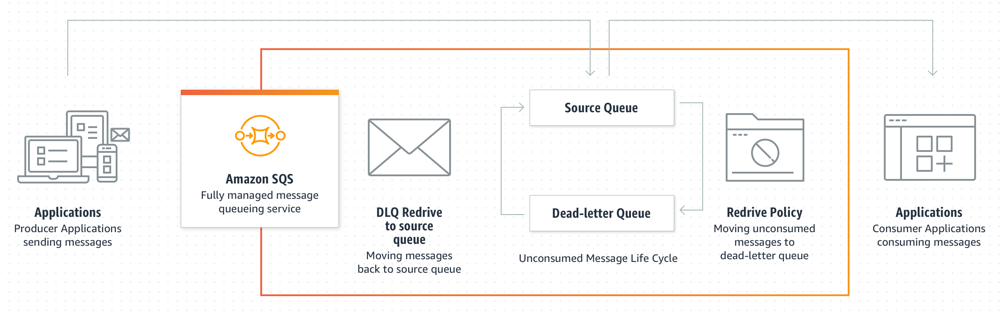
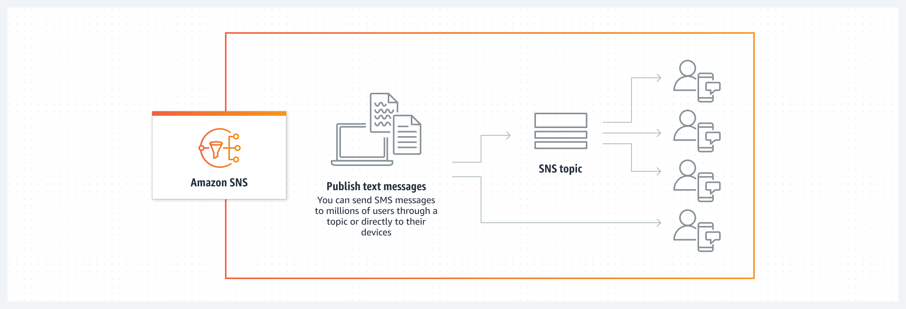

### [SQS](#amazon-simple-queue-service)
### [SNS](#amazon-simple-notification-service)
### [Amazon Kinesis](#amazon-kinesis-1)

# AWS Integration & Messaging

## Amazon Simple Queue Service
Fully managed message queuing for microservices, distributed systems, and serverless applications

(Message Queuing Service - Amazon Simple Queue Service - AWS)

### Benefits of Amazon Simple Queue Service
**Overhead made simple:** Eliminate overhead with no upfront costs and without needing to manage software or maintain infrastructure. 

**Reliability at scale:** Reliably deliver large volumes of data, at any level of throughput, without losing messages or needing other services to be available.

**Security:** Securely send sensitive data between applications and centrally manage your keys using AWS Key Management. 

**Cost-effective scalability:** Scale elastically and cost-effectively based on usage so you don’t have to worry about capacity planning and preprovisioning. 
***

Amazon Simple Queue Service (Amazon SQS) lets you send, store, and receive messages between software components at any volume, without losing messages or requiring other services to be available.


### Use Cases
**Increase application reliability and scale:**

>Amazon SQS provides a simple and reliable way for customers to decouple and connect components (microservices) together using queues.

**Decouple microservices and process event-driven applications**
> Separate frontend from backend systems, such as in a banking application. Customers immediately get a response, but the bill payments are processed in the background.

**Ensure work is completed cost-effectively and on time**
>Place work in a single queue where multiple workers in an autoscale group scale up and down based on workload and latency requirements.

**Maintain message ordering with deduplication**
> Process messages at high scale while maintaining the message order, allowing you to deduplicate messages.

## Message lifecycle

The following scenario describes the lifecycle of an Amazon SQS message in a queue, from creation to deletion.

1. A producer (component 1) sends message A to a queue, and the message is distributed across the Amazon SQS servers redundantly.
2. When a consumer (component 2) is ready to process messages, it consumes messages from the queue, and message A is returned. While message A is being processed, it remains in the queue and isn't returned to subsequent receive requests for the duration of the [visibility timeout](https://docs.aws.amazon.com/AWSSimpleQueueService/latest/SQSDeveloperGuide/sqs-visibility-timeout.html).
3. The consumer (component 2) deletes message A from the queue to prevent the message from being received and processed again when the visibility timeout expires.

> Note
>
>Amazon SQS automatically deletes messages that have been in a queue for more than the maximum message retention period. The default message retention period is 4 days. However, you can set the message retention period to a value from 60 seconds to 1,209,600 seconds (14 days) using the SetQueueAttributes action.

## Differences between Amazon SQS, Amazon MQ, and Amazon SNS
**Amazon SQS** offers hosted queues that integrate and decouple distributed software systems and components. Amazon SQS provides a generic web services API that you can access using any programming language supported by AWS SDK. Messages in the queue are typically processed by a single subscriber. `Amazon SQS and Amazon SNS `are often used together to create a `fanout messaging application`


**Amazon SNS** is a publish-subscribe service that provides message delivery from publishers (also known as producers) to multiple subscriber endpoints(also known as consumers). Publishers communicate asynchronously with subscribers by sending messages to a topic, which is a logical access point and communication channel. Subscribers can subscribe to an Amazon SNS topic and receive published messages using a supported endpoint type, such as Amazon Kinesis Data Firehose, Amazon SQS, Lambda, HTTP, email, mobile push notifications, and mobile text messages (SMS). Amazon SNS acts as a message router and delivers messages to subscribers in real time. `If a subscriber is not available at the time of message publication, the message is not stored for later retrieval`.

**Amazon MQ** is a managed message `broker service that provides compatibility with industry standard messaging protocols` such as Advanced Message Queueing Protocol (AMQP) and Message Queuing Telemetry Transport (MQTT). Amazon MQ currently supports Apache ActiveMQ
and RabbitMQ engine types. 


| Resource type | Amazon SNS | Amazon SQS | Amazon MQ |
| ------------- | ---------- | ---------- | --------- |
| Synchronous | No | No | Yes |
| Asynchronous | Yes | Yes | Yes |
| Queues | No | Yes | Yes |
| Publisher-subscriber messaging | Yes | No | Yes |
| Message brokers | No | No | Yes |


## Amazon SQS queue types

| Standard queues | FIFO queues |
| --------------- | ----------- |
| **Unlimited Throughput** – Standard queues support a nearly unlimited number of API calls per second, per API action (SendMessage, ReceiveMessage, or DeleteMessage).<br><br> **At-Least-Once Delivery** – A message is delivered at least once, but occasionally more than one copy of a message is delivered.<br><br> **Best-Effort Ordering** – Occasionally, messages are delivered in an order different from which they were sent.| **High Throughput** – If you use batching, FIFO queues support up to 3,000 messages per second, per API method (SendMessageBatch, ReceiveMessage, or DeleteMessageBatch). The 3,000 messages per second represent 300 API calls, each with a batch of 10 messages. To request a quota increase, submit a support request. Without batching, FIFO queues support up to 300 API calls per second, per API method (SendMessage, ReceiveMessage, or DeleteMessage).<br><br> **Exactly-Once Processing** – A message is delivered once and remains available until a consumer processes and deletes it. Duplicates aren't introduced into the queue.<br><br> **First-In-First-Out Delivery** – The order in which messages are sent and received is strictly preserved. |
|  |  |
| Send data between applications when the throughput is important, for example:<br><ul> <li>Decouple live user requests from intensive background work: let users upload media while resizing or encoding it.</li><br><li> Allocate tasks to multiple worker nodes: process a high number of credit card validation requests.</li><br><li>Batch messages for future processing: schedule multiple entries to be added to a database.</li></ul> | Send data between applications when the order of events is important, for example:<br> <ul> <li>Make sure that user-entered commands are run in the right order.</li><br> <li>Display the correct product price by sending price modifications in the right order.</li><br> <li>Prevent a student from enrolling in a course before registering for an account.</li></ul> |

### Use target tracking with the right metric

If you use a target tracking scaling policy based on a custom Amazon SQS queue metric, dynamic scaling can adjust to the demand curve of your application more effectively. 

The issue with using a CloudWatch Amazon SQS metric like `ApproximateNumberOfMessagesVisible` for target tracking is that the number of messages in the queue might not change proportionally to the size of the Auto Scaling group that processes messages from the queue. That's because the number of messages in your SQS queue does not solely define the number of instances needed. The number of instances in your Auto Scaling group can be driven by multiple factors, including how long it takes to process a message and the acceptable amount of latency (queue delay). 


The solution is to use a backlog per instance metric with the target value being the acceptable backlog per instance to maintain. You can calculate these numbers as follows:

- Backlog per instance: To calculate your backlog per instance, start with the `ApproximateNumberOfMessages` queue attribute to determine the length of the SQS queue (number of messages available for retrieval from the queue). Divide that number by the fleet's running capacity, which for an Auto Scaling group is the number of instances in the InService state, to get the backlog per instance.

- Acceptable backlog per instance: To calculate your target value, first determine what your application can accept in terms of latency. Then, take the acceptable latency value and divide it by the average time that an EC2 instance takes to process a message.

The following procedures demonstrate how to publish the custom metric and create the target tracking scaling policy that configures your Auto Scaling group to scale based on these calculations.

> 🔥 Important
>
>Remember, to reduce costs, use metric math instead. For more information, see [Create a target tracking scaling policy for Amazon EC2 Auto Scaling using metric math](https://docs.aws.amazon.com/autoscaling/ec2/userguide/ec2-auto-scaling-target-tracking-metric-math.html).

There are three main parts to this configuration:

- An Auto Scaling group to manage EC2 instances for the purposes of processing messages from an SQS queue.

- A custom metric to send to Amazon CloudWatch that measures the number of messages in the queue per EC2 instance in the Auto Scaling group.

- A target tracking policy that configures your Auto Scaling group to scale based on the custom metric and a set target value. CloudWatch alarms invoke the scaling policy.

The following diagram illustrates the architecture of this configuration. 


### Decouple messaging pattern
This pattern provides asynchronous communication between microservices by using an asynchronous poll model. When the backend system receives a call, it immediately responds with a request identifier and then asynchronously processes the request. <ins>A loosely coupled architecture can be built, which avoids bottlenecks caused by synchronous communication, latency, and input/output operations (IO). In the pattern's use case, Amazon Simple Queue Service (Amazon SQS) and Lambda are used to implement asynchronous communication between different microservices.</ins>

You should consider using this pattern if:

- You want to create loosely coupled architecture.

- All operations don’t need to be completed in a single transaction, and some operations can be asynchronous.

- The downstream system cannot handle the incoming transactions per second (TPS) rate. The messages can be written to the queue and processed based on the availability of resources.

A disadvantage of this pattern is that business transaction actions are synchronous. Even though the calling system receives a response, some part of the transaction might still continue to be processed by downstream systems.

>🔥Important
>
> Because this pattern is more suitable for a fire-and-forget model, the client calling this service should poll the actual service by using a request ID to get the transaction status.

### Use case

In this use case, the insurance system has a sales database that is automatically updated with the customer transaction details after a monthly payment is made. The following illustration shows how to build this system by using the decouple messaging pattern.


The workflow consists of the following steps:

1. The frontend application calls the API Gateway with the payment information after a user makes their monthly payment.

2. The API Gateway runs the “Customer” Lambda function that saves the payment information in an Amazon Aurora database, writes the transaction details in a message to the “Sales" Amazon SQS, and responds to the calling system with a success message.

3. A “Sales” Lambda function pulls the transaction details from the SQS message and updates the sales data. Failure and retry logic to update the sales database is incorporated as part of the “Sales” Lambda function.

### Security in Amazon SQS
- Data protection
- Identity and access management in Amazon SQS
- Logging and monitoring in Amazon SQS
- Compliance validation for Amazon SQS
- Resilience in Amazon SQS
- Infrastructure security in Amazon SQS
- Amazon SQS security best practices


## Basic examples of Amazon SQS policies
### Example 1: Grant one permission to one AWS account

The following example policy grants AWS account number `111122223333` the `SendMessage` permission for the queue named `444455556666/queue1` in the US East (Ohio) region.
``` json
{
   "Version": "2012-10-17",
   "Id": "Queue1_Policy_UUID",
   "Statement": [{
      "Sid":"Queue1_SendMessage",
      "Effect": "Allow",
      "Principal": {
         "AWS": [ 
            "111122223333"
         ]
      },
      "Action": "sqs:SendMessage",
      "Resource": "arn:aws:sqs:us-east-2:444455556666:queue1"
   }]  
}
```
### Grant cross-account permissions to a role and a username

The following example policy grants `role1` and `username1` under AWS account number `111122223333` cross-account permission to use all actions to which Amazon SQS allows shared access for the queue named `123456789012/queue1` in the US East (Ohio) region.

Cross-account permissions don't apply to the following actions:

- `AddPermission`

- `CancelMessageMoveTask`

- `CreateQueue`

- `DeleteQueue`

- `ListMessageMoveTask`

- `ListQueues`

- `ListQueueTags`

- `RemovePermission`

- `SetQueueAttributes`

- `StartMessageMoveTask`

- `TagQueue`

- `UntagQueue`

``` json
{
   "Version": "2012-10-17",
   "Id": "Queue1_Policy_UUID",
   "Statement": [{
      "Sid":"Queue1_AllActions",
      "Effect": "Allow",
      "Principal": {
         "AWS": [
            "arn:aws:iam::111122223333:role/role1",
            "arn:aws:iam::111122223333:user/username1"
         ]
      },
      "Action": "sqs:*",
      "Resource": "arn:aws:sqs:us-east-2:123456789012:queue1"
   }]
}
```
### Amazon SQS visibility timeout
***
When a consumer receives and processes a message from a queue, the message remains in the queue. `Amazon SQS doesn't automatically delete the message`. Because Amazon SQS is a distributed system, there's no guarantee that the consumer actually receives the message (for example, due to a connectivity issue, or due to an issue in the consumer application). Thus, the consumer must delete the message from the queue after receiving and processing it.


Immediately after a message is received, it remains in the queue. `To prevent other consumers from processing the message again, Amazon SQS sets a visibility timeout`, a period of time during which Amazon SQS prevents all consumers from receiving and processing the message. The default visibility timeout for a message is 30 seconds. The minimum is 0 seconds. The maximum is 12 hours. 

>Note
>
>For standard queues, the visibility timeout isn't a guarantee against receiving a message twice. For more information, see At-least-once delivery.
>
>FIFO queues allow the producer or consumer to `attempt multiple retries`:
>
>- If the producer detects a failed SendMessage action, **it can retry sending as many times as necessary**, using the same message deduplication ID. Assuming that the producer receives at least one acknowledgement before the **deduplication interval expires**, multiple <ins>retries neither affect the ordering of messages nor introduce duplicates</ins>.
>
>- If the consumer detects a failed ReceiveMessage action, it can retry as many times as necessary, using the same receive request attempt ID. Assuming that the consumer receives at least one acknowledgement before the visibility timeout expires, multiple retries don't affect the ordering of messages.
>
>- When you receive a message with a message group ID, no more messages for the same message group ID are returned unless you delete the message or it becomes visible.

For most standard queues (depending on queue traffic and message backlog), there can be a maximum of approximately 120,000 in flight messages (received from a queue by a consumer, but not yet deleted from the queue). If you reach this quota while using short polling, Amazon SQS returns the OverLimit error message. If you use long polling, Amazon SQS returns no error messages. To avoid reaching the quota, you should delete messages from the queue after they're processed. You can also increase the number of queues you use to process your messages.

> ! Important
>
> When working with FIFO queues, DeleteMessage operations will fail if the request is received outside of the visibility timeout window. If the visibility timeout is 0 seconds, the message must be deleted within the same millisecond it was sent, or it is considered abandoned. This can cause Amazon SQS to include duplicate messages in the same response to a `ReceiveMessage` operation if the `MaxNumberOfMessages` parameter is greater than 1. 

### Setting the visibility timeout

The visibility timeout begins when Amazon SQS returns a message. During this time, the consumer processes and deletes the message. However, if the consumer fails before deleting the message and your system doesn't call the `DeleteMessage` action for that message before the visibility timeout expires, the message becomes visible to other consumers and the message is received again. If a message must be received only once, your consumer should delete it within the duration of the visibility timeout.

Every Amazon SQS queue has the default visibility timeout setting of 30 seconds. You can change this setting for the entire queue. Typically, you should set the visibility timeout to the maximum time that it takes your application to process and delete a message from the queue. When receiving messages, you can also set a special visibility timeout for the returned messages without changing the overall queue timeout. For more information, see the [best practices in the Processing messages](https://docs.aws.amazon.com/AWSSimpleQueueService/latest/SQSDeveloperGuide/working-with-messages.html#processing-messages-timely-manner) in a timely manner section.

> ! Important
>
>The maximum visibility timeout is 12 hours from the time that Amazon SQS receives the ReceiveMessage request. Extending the visibility timeout does not reset the 12 hour maximum.
>
>it will likely fail (more than 12 hour).
>
> If your consumer needs longer than 12 hours, consider using Step Functions.


### Changing the visibility timeout for a message
You can shorten or extend a message's visibility by specifying a new timeout value using the `ChangeMessageVisibility` action.

For example, if the default timeout for a queue is 60 seconds, 15 seconds have elapsed since you received the message, and you send a `ChangeMessageVisibility` call with `VisibilityTimeout` set to 10 seconds, the 10 seconds begin to count from the time that you make the `ChangeMessageVisibility` call. Thus, any attempt to change the visibility timeout or to delete that message 10 seconds after you initially change the visibility timeout (a total of 25 seconds) might result in an error.

> Note
>
>The new timeout period takes effect from the time you call the ChangeMessageVisibility action. In addition, the new timeout period applies only to the particular receipt of the message. ChangeMessageVisibility doesn't affect the timeout of later receipts of the message or later queues.

### Terminating the visibility timeout for a message

When you receive a message from a queue, you might find that you actually don't want to process and delete that message. Amazon SQS allows you to terminate the visibility timeout for a specific message. This makes the message immediately visible to other components in the system and available for processing.

To terminate a message's visibility timeout after calling ReceiveMessage, call `ChangeMessageVisibility` with `VisibilityTimeout` set to 0 seconds. 

### Consuming messages using long polling

When the wait time for the `ReceiveMessage` API action is greater than 0, long polling is in effect. The maximum long polling wait time is 20 seconds. Long polling helps reduce the cost of using Amazon SQS by eliminating the number of empty responses (when there are no messages available for a `ReceiveMessage` request) and false empty responses (when messages are available but aren't included in a response). For information about enabling long polling for a new or existing queue using the Amazon SQS console, see the [Configuring queue parameters](https://docs.aws.amazon.com/AWSSimpleQueueService/latest/SQSDeveloperGuide/sqs-configure-queue-parameters.html) (console). For best practices, see [Setting up long polling](https://docs.aws.amazon.com/AWSSimpleQueueService/latest/SQSDeveloperGuide/working-with-messages.html#setting-up-long-polling).

Long polling offers the following benefits:

- Reduce empty responses by allowing Amazon SQS to wait until a message is available in a queue before sending a response. Unless the connection times out, the response to the `ReceiveMessage` request contains at least one of the available messages, up to the maximum number of messages specified in the `ReceiveMessage` action. In rare cases, you might receive empty responses even when a queue still contains messages, especially if you specify a low value for the `ReceiveMessageWaitTimeSeconds` parameter.

- Reduce false empty responses by querying all—rather than a subset of—Amazon SQS servers.

- Return messages as soon as they become available.

### Consuming messages using short polling

When you consume messages from a queue using short polling, Amazon SQS samples a subset of its servers (based on a weighted random distribution) and returns messages from only those servers. Thus, a particular `ReceiveMessage` request might not return all of your messages. However, if you have fewer than 1,000 messages in your queue, a subsequent request will return your messages. If you keep consuming from your queues, Amazon SQS samples all of its servers, and you receive all of your messages.

The following diagram shows the short-polling behavior of messages returned from a standard queue after one of your system components makes a receive request. Amazon SQS samples several of its servers (in gray) and returns messages A, C, D, and B from these servers. Message E isn't returned for this request, but is returned for a subsequent (meaning = coming after something in time; following) request.


### Differences between long and short polling

Short polling occurs when the `WaitTimeSeconds` parameter of a `ReceiveMessage` request is set to 0 in one of two ways:

- The `ReceiveMessage` call sets `WaitTimeSeconds` to 0.

- The `ReceiveMessage` call doesn’t set `WaitTimeSeconds`, but the queue attribute `ReceiveMessageWaitTimeSeconds` is set to 0.

## Amazon SQS dead-letter queues
Amazon SQS supports dead-letter queues (DLQ), which other queues (source queues) can target for messages that can't be processed (consumed) successfully. <ins>Dead-letter queues are useful for debugging your application or messaging system because they let you isolate unconsumed messages to determine why their processing didn't succeed.</ins> For information about configuring a dead-letter queue using the Amazon SQS console, see Configuring a dead-letter queue (console). Once you have debugged the consumer application or the consumer application is available to consume the message, you can use the dead-letter queue redrive capability to move the messages back to the source queue.

### How do dead-letter queues work?

Sometimes, messages can't be processed because of a variety of possible issues, such as erroneous conditions within the producer or consumer application or an unexpected state change that causes an issue with your application code. For example, if a user places a web order with a particular product ID, but the product ID is deleted, the web store's code fails and displays an error, and the message with the order request is sent to a dead-letter queue.

Occasionally, producers and consumers might fail to interpret aspects of the protocol that they use to communicate, causing message corruption or loss. Also, the consumer's hardware errors might corrupt message payload.

The redrive policy specifies the source queue, the dead-letter queue, and the conditions under which Amazon SQS moves messages from the former to the latter if the consumer of the source queue fails to process a message a specified number of times. The `maxReceiveCount` is the number of times a consumer tries receiving a message from a queue without deleting it before being moved to the dead-letter queue. Setting the `maxReceiveCount` to a low value such as 1 would result in any failure to receive a message to cause the message to be moved to the dead-letter queue. Such failures include network errors and client dependency errors. To ensure that your system is resilient against errors, set the `maxReceiveCount` high enough to allow for sufficient retries.

<ins>The redrive allow policy specifies which source queues can access the dead-letter queue.</ins> This policy applies to a potential dead-letter queue. You can choose whether to allow all source queues, allow specific source queues, or deny all source queues. The default is to allow all source queues to use the dead-letter queue. If you choose to allow specific queues (using the byQueue option), you can specify up to 10 source queues using the source queue Amazon Resource Name (ARN). If you specify denyAll, the queue cannot be used as a dead-letter queue

>! Important
>
>The dead-letter queue of a FIFO queue must also be a FIFO queue. Similarly, the dead-letter queue of a standard queue must also be a standard queue.
>
>You must use the same AWS account to create the dead-letter queue and the other queues that send messages to the dead-letter queue. Also, dead-letter queues must reside in the same region as the other queues that use the dead-letter queue. For example, if you create a queue in the US East (Ohio) region and you want to use a dead-letter queue with that queue, the second queue must also be in the US East (Ohio) region.
>
>For standard queues, the expiration of a message is always based on its original enqueue timestamp. When a message is moved to a dead-letter queue, the enqueue timestamp is unchanged. The *ApproximateAgeOfOldestMessage* metric indicates when the message moved to the dead-letter queue, not when the message was originally sent. For example, assume that a message spends 1 day in the original queue before it's moved to a dead-letter queue. If the dead-letter queue's retention period is 4 days, the message is deleted from the dead-letter queue after 3 days and the *ApproximateAgeOfOldestMessage* is 3 days. Thus, it is a best practice to always set the retention period of a dead-letter queue to be longer than the retention period of the original queue.
>
>For FIFO queues, the enqueue timestamp resets when the message is moved to a dead-letter queue. The *ApproximateAgeOfOldestMessage* metric indicates when the message moved to the dead-letter queue. In the same example above, the message is deleted from the dead-letter queue after 4 days and the *ApproximateAgeOfOldestMessage* is 4 days

### What are the benefits of dead-letter queues?

The main task of a dead-letter queue is to handle the lifecycle of unconsumed messages. A dead-letter queue lets you set aside and isolate messages that can't be processed correctly to determine why their processing didn't succeed. Setting up a dead-letter queue allows you to do the following:

- Configure an alarm for any messages moved to a dead-letter queue.

- Examine logs for exceptions that might have caused messages to be moved to a dead-letter queue.

- Analyze the contents of messages moved to a dead-letter queue to diagnose software or the producer's or consumer's hardware issues.

- Determine whether you have given your consumer sufficient time to process messages.

### When should I use a dead-letter queue?

✅ Do use dead-letter queues with standard queues. You should always take advantage of dead-letter queues when your applications don't depend on ordering. Dead-letter queues can help you troubleshoot incorrect message transmission operations.
> Note
>
>Even when you use dead-letter queues, you should continue to monitor your queues and retry sending messages that fail for transient reasons.

✅ Do use dead-letter queues to decrease the number of messages and to reduce the possibility of exposing your system to poison-pill messages (messages that can be received but can't be processed).

❌ Don't use a dead-letter queue with standard queues when you want to be able to keep retrying the transmission of a message indefinitely. For example, don't use a dead-letter queue if your program must wait for a dependent process to become active or available.

❌ Don't use a dead-letter queue with a FIFO queue if you don't want to break the exact order of messages or operations. For example, don't use a dead-letter queue with instructions in an Edit Decision List (EDL) for a video editing suite, where changing the order of edits changes the context of subsequent edits.

### Moving messages out of a dead-letter queue

You can use dead-letter queue redrive to manage the lifecycle of unconsumed messages. After you have investigated the attributes and related metadata available for unconsumed messages in a standard or FIFO dead-letter queue, you can redrive the messages back to their source queues. Dead-letter queue redrive reduces API call billing by batching the messages while moving them.

The redrive task uses Amazon SQS's *SendMessageBatch*, *ReceiveMessage*, and *DeleteMessageBatch* APIs on behalf of the user to redrive the messages. Therefore, all redriven messages are considered new messages with a new `messageid`, `enqueueTime`, and retention period. The pricing of dead-letter queue redrive uses the number of API calls invoked and bills based on the Amazon SQS pricing

By default, dead-letter queue redrive moves messages from a dead-letter queue to a source queue. However, you can also configure any other queue as the redrive destination if both queues are the same type. For example, if the dead-letter queue is a FIFO queue, the redrive destination queue must be a FIFO queue as well. Additionally, you can configure the redrive velocity to set the rate at which Amazon SQS moves messages. 

## Amazon SQS temporary queues

Temporary queues help you save development time and deployment costs when using common message patterns such as request-response. You can use the Temporary Queue Client

to create high-throughput, cost-effective, application-managed temporary queues.

The client maps multiple temporary queues—application-managed queues created on demand for a particular process—onto a single Amazon SQS queue automatically. This allows your application to make fewer API calls and have a higher throughput when the traffic to each temporary queue is low. When a temporary queue is no longer in use, the client cleans up the temporary queue automatically, even if some processes that use the client aren't shut down cleanly.

The following are the benefits of temporary queues:

- They serve as lightweight communication channels for specific threads or processes.

- They can be created and deleted without incurring additional cost.

- They are API-compatible with static (normal) Amazon SQS queues. This means that existing code that sends and receives messages can send messages to and receive messages from virtual queues.

### Virtual queues

Virtual queues are local data structures that the Temporary Queue Client creates. Virtual queues let you combine multiple low-traffic destinations into a single Amazon SQS queue. For best practices, see Avoid reusing the [same message group ID with virtual queues](https://docs.aws.amazon.com/AWSSimpleQueueService/latest/SQSDeveloperGuide/using-messagegroupid-property.html#avoiding-reusing-message-group-id-with-virtual-queues).

### Request-response messaging pattern (virtual queues)

The most common use case for temporary queues is the request-response messaging pattern, where a requester creates a temporary queue for receiving each response message. To avoid creating an Amazon SQS queue for each response message, the Temporary Queue Client lets you create and delete multiple temporary queues without making any Amazon SQS API calls.

The following diagram shows a common configuration using this pattern.


## Amazon SQS delay queues
Delay queues let you postpone the delivery of new messages to consumers for a number of seconds, for example, when your consumer application needs additional time to process messages. If you create a delay queue, <ins>any messages that you send to the queue remain invisible to consumers for the duration of the delay period</ins>. The default (minimum) delay for a queue is 0 seconds. The maximum is 15 minutes.


> Note
>
>For standard queues, the per-queue delay setting is not retroactive—changing the setting doesn't affect the delay of messages already in the queue.
>
>For FIFO queues, the per-queue delay setting is retroactive—changing the setting affects the delay of messages already in the queue.

Delay queues are similar to [visibility timeouts](#amazon-sqs-visibility-timeout) because both features make messages unavailable to consumers for a specific period of time. The difference between the two is that, for delay queues, a message is hidden when it is first added to queue, whereas for visibility timeouts a message is hidden only after it is consumed from the queue. The following diagram illustrates the relationship between delay queues and visibility timeouts. 


To set delay seconds on individual messages, rather than on an entire queue, use message timers to allow Amazon SQS to use the message timer's DelaySeconds value instead of the delay queue's DelaySeconds value.


## Managing large Amazon SQS messages using Amazon S3
To manage large Amazon Simple Queue Service (Amazon SQS) messages, you can use Amazon Simple Storage Service (Amazon S3) and the **Amazon SQS Extended Client Library** for Java. This is especially useful for storing and consuming messages up to 2 GB. Unless your application requires repeatedly creating queues and leaving them inactive or storing large amounts of data in your queues, consider using Amazon S3 for storing your data.

You can use the **Amazon SQS Extended Client Library** for Java to do the following:

- Specify whether messages are always stored in Amazon S3 or only when the size of a message exceeds 256 KB

- Send a message that references a single message object stored in an S3 bucket

- Retrieve the message object from an S3 bucket

- Delete the message object from an S3 bucket

You can use the **Amazon SQS Extended Client Library** for Java to manage Amazon SQS messages using Amazon S3 only with the AWS SDK for Java. You can't do this with the AWS CLI, the Amazon SQS console, the Amazon SQS HTTP API, or any of the other AWS SDKs.

## Using the Amazon SQS message deduplication ID
Message deduplication ID is the token used for deduplication of sent messages. If a message with a particular message deduplication ID is sent successfully, any messages sent with the same message deduplication ID are accepted successfully but aren't delivered during the 5-minute deduplication interval.

> Note
>
>Amazon SQS continues to keep track of the message deduplication ID even after the message is received and deleted.

### Providing the message deduplication ID

The producer should provide message deduplication ID values for each message in the following scenarios:

- Messages sent with identical message bodies that Amazon SQS must treat as unique.

- Messages sent with identical content but different message attributes that Amazon SQS must treat as unique.

- Messages sent with different content (for example, retry counts included in the message body) that Amazon SQS must treat as duplicates.

## Using the Amazon SQS message group ID
`MessageGroupId` is the tag that specifies that a message belongs to a specific message group. Messages that belong to the same message group are always processed one by one, in a strict order relative to the message group (however, messages that belong to different message groups might be processed out of order).

## Amazon Simple Notification Service
Fully managed Pub/Sub service for A2A and A2P messaging

or Push Notification service

| Deliver application-to-application (A2A) notifications to integrate and decouple distributed applications. | Distribute application- to-person (A2P) notifications to your customers with SMS texts, push notifications, and email. | Simplify your architecture and reduce costs with message filtering, batching, ordering, and deduplication. | Increase message durability with archiving, replay, delivery retries, and dead-letter queues (DLQs). |
| ------ | ----------- | --------- | ------- |

### How it works

Amazon Simple Notification Service (Amazon SNS) sends notifications two ways, A2A and A2P. A2A provides high-throughput, push-based, many-to-many messaging between distributed systems, microservices, and event-driven serverless applications. These applications include Amazon Simple Queue Service (SQS), Amazon Kinesis Data Firehose, AWS Lambda, and other HTTPS endpoints. A2P functionality lets you send messages to your customers with SMS texts, push notifications, and email. 

pub/ sub


SMS



Mobile Push:


### Use cases
**Integrate your applications with FIFO messaging**
> Deliver messages in a strictly ordered, first in, first out (FIFO) manner to maintain accuracy and consistency across independent applications.

**Securely encrypt notification message delivery**
> Encrypt messages with AWS Key Management Service (KMS), ensure traffic privacy with AWS PrivateLink, and control access with resource policies and tags.

**Capture and fan out events from over 60 AWS services**
> Fan out events across AWS categories, such as analytics, compute, containers, databases, IoT, machine learning (ML), security, and storage.

**Send SMS texts to customers across over 240 countries**
> Use worldwide SMS, with redundancy across providers. Set SMS origination identity with a sender ID, long code, short code, TFN, or 10DLC.

Amazon Simple Notification Service (Amazon SNS) is a managed service that provides message delivery from publishers to subscribers (also known as producers and consumers). Publishers communicate asynchronously with subscribers by sending messages to a topic, which is a logical access point and communication channel. Clients can subscribe to the SNS topic and receive published messages using a supported endpoint type, such as Amazon Kinesis Data Firehose, Amazon SQS, AWS Lambda, HTTP, email, mobile push notifications, and mobile text messages (SMS).


## Features and capabilities
Amazon SNS provides the following features and capabilities:

- **Application-to-application messaging**

   Application-to-application messaging supports subscribers such as Amazon Kinesis Data Firehose delivery streams, Lambda functions, Amazon SQS queues, HTTP/S endpoints, and AWS Event Fork Pipelines. For more information, see Using Amazon SNS for application-to-application (A2A) messaging.

- **Application-to-person notifications**

   Application-to-person notifications provide user notifications to subscribers such as mobile applications, mobile phone numbers, and email addresses. For more information, see Using Amazon SNS for application-to-person (A2P) messaging.

- **Standard and FIFO topics**

   Use a FIFO topic to ensure strict message ordering, to define message groups, and to prevent message duplication. You can use both FIFO and standard queues to subscribe to a FIFO topic. For more information, see Message ordering and deduplication (FIFO topics).

   Use a standard topic when message delivery order and possible message duplication are not critical. All of the supported delivery protocols can subscribe to a standard topic.

- **Message durability**

   Amazon SNS uses a number of strategies that work together to provide message durability (able to withstand wear, pressure, or damage):

   - Published messages are stored across multiple, geographically separated servers and data centers.

    - If a subscribed endpoint isn't available, Amazon SNS runs a delivery retry policy.

   - To preserve any messages that aren't delivered before the delivery retry policy ends, you can create a dead-letter queue.

- **Message archiving, replay, and analytics**

    You can archive messages with Amazon SNS in multiple ways including subscribing Kinesis Data Firehose delivery streams to SNS topics, which allows you to send notifications to analytics endpoints such as Amazon Simple Storage Service (Amazon S3) buckets, Amazon Redshift tables, and more. Additionally, Amazon SNS FIFO topics support message archiving and replay as a no-code, in-place message archive that lets topic owners store (or archive) messages within their topic. Topic subscribers can then retrieve (or replay) the archived messages back to a subscribed endpoint. For more, see Message archiving and replay for FIFO topics.

- Message attributes

    Message attributes let you provide any arbitrary metadata about the message. Amazon SNS message attributes.

- Message filtering

    By default, each subscriber receives every message published to the topic. To receive a subset of the messages, a subscriber must assign a filter policy to the topic subscription. A subscriber can also define the filter policy scope to enable payload-based or attribute-based filtering. The default value for the filter policy scope is `MessageAttributes`. When the incoming message attributes match the filter policy attributes, the message is delivered to the subscribed endpoint. Otherwise, the message is filtered out. When the filter policy scope is `MessageBody`, filter policy attributes are matched against the payload. For more information, see Amazon SNS message filtering.

- Message security

    Server-side encryption protects the contents of messages that are stored in Amazon SNS topics, using encryption keys provided by AWS KMS. For more information, see Encryption at rest.

    You can also establish a private connection between Amazon SNS and your virtual private cloud (VPC). for more information, see Internetwork traffic privacy.

## Common Amazon SNS scenarios
### Application integration

The Fanout scenario is when a message published to an SNS topic is replicated and pushed to multiple endpoints, such as Kinesis Data Firehose delivery streams, Amazon SQS queues, HTTP(S) endpoints, and Lambda functions. This allows for parallel asynchronous processing.

For example, you can develop an application that publishes a message to an SNS topic whenever an order is placed for a product. Then, SQS queues that are subscribed to the SNS topic receive identical notifications for the new order. An Amazon Elastic Compute Cloud (Amazon EC2) server instance attached to one of the SQS queues can handle the processing or fulfillment of the order. And you can attach another Amazon EC2 server instance to a data warehouse for analysis of all orders received.


You can also use fanout to replicate data sent to your production environment with your test environment. Expanding upon the previous example, you can subscribe another SQS queue to the same SNS topic for new incoming orders. Then, by attaching this new SQS queue to your test environment, you can continue to improve and test your application using data received from your production environment.

> ! Important
> 
>Make sure that you consider data privacy and security before you send any production data to your test environment.


- [Fanout to Kinesis Data Firehose delivery streams](https://docs.aws.amazon.com/sns/latest/dg/sns-firehose-as-subscriber.html)

- [Fanout to Lambda functions](https://docs.aws.amazon.com/sns/latest/dg/sns-lambda-as-subscriber.html)

- [Fanout to Amazon SQS queues](https://docs.aws.amazon.com/sns/latest/dg/sns-sqs-as-subscriber.html)

- [Fanout to HTTP(S) endpoints](https://docs.aws.amazon.com/sns/latest/dg/sns-http-https-endpoint-as-subscriber.html)

- [Event-Driven Computing with Amazon SNS and AWS Compute, Storage, Database, and Networking Services](https://aws.amazon.com/blogs/compute/event-driven-computing-with-amazon-sns-compute-storage-database-and-networking-services/)

### Application alerts

Application and system alerts are notifications that are triggered by predefined thresholds. Amazon SNS can send these notifications to specified users via SMS and email. For example, you can receive immediate notification when an event occurs, such as a specific change to your Amazon EC2 Auto Scaling group, a new file uploaded to an Amazon S3 bucket, or a metric threshold breached in Amazon CloudWatch. For more information, see [Setting up Amazon SNS notifications](https://docs.aws.amazon.com/AmazonCloudWatch/latest/monitoring/US_SetupSNS.html) in the Amazon CloudWatch User Guide.

### User notifications

Amazon SNS can send push email messages and text messages (SMS messages) to individuals or groups. For example, you could send e-commerce order confirmations as user notifications. For more information about using Amazon SNS to send SMS messages, see [Mobile text messaging (SMS)](https://docs.aws.amazon.com/sns/latest/dg/sns-mobile-phone-number-as-subscriber.html).

### Mobile push notifications

Mobile push notifications enable you to send messages directly to mobile apps. For example, you can use Amazon SNS to send update notifications to an app. The notification message can include a link to download and install the update. For more information about using Amazon SNS to send push notification messages, see [Mobile push notifications.](https://docs.aws.amazon.com/sns/latest/dg/sns-mobile-application-as-subscriber.html)

## Message ordering and deduplication (FIFO topics)
You can use Amazon SNS FIFO (first in, first out) topics with Amazon SQS FIFO queues to provide strict message ordering and message deduplication. The FIFO capabilities of each of these services work together to act as a fully managed service to integrate distributed applications that require data consistency in near-real time. Subscribing Amazon SQS standard queues to Amazon SNS FIFO topics provides best-effort ordering and at least once delivery

## FIFO topics example use case

The following example describes an ecommerce platform built by an auto parts manufacturer using Amazon SNS FIFO topics and Amazon SQS queues. The platform is composed of four serverless applications:

- Inventory managers use a price management application to set the price for each item in stock. At this company, product prices can change based on currency exchange fluctuation, market demand, and shifts in sales strategy. The price management application uses an AWS Lambda function that publishes price updates to an Amazon SNS FIFO topic whenever prices change.

- A wholesale application provides the backend for a website where auto body shops and car manufacturers can buy the company's auto parts in bulk. To get price change notifications, the wholesale application subscribes its Amazon SQS FIFO queue to the price management application's Amazon SNS FIFO topic.

- A retail application provides the backend for another website where car owners and car tuning enthusiasts can purchase individual auto parts for their vehicles. To get price change notifications, the retail application also subscribes its Amazon SQS FIFO queue to the price management application's Amazon SNS FIFO topic.

- An analytics application that aggregates price updates and stores them into an Amazon S3 bucket, enabling Amazon Athena to query the bucket for business intelligence (BI) purposes. To get price change notifications, the analytics application subscribes its Amazon SQS standard queue to the price management application's Amazon SNS FIFO topic. Unlike the other applications, the analytics one doesn't require the price updates to be strictly ordered.


For the wholesale and retail applications to receive price updates in the correct order, the price management application must use a strictly ordered message distribution system. Using Amazon SNS FIFO topics and Amazon SQS FIFO queues enables the processing of messages in order and with no duplication.

## Amazon SNS message filtering
By default, an Amazon SNS topic subscriber receives every message that's published to the topic. To receive only a subset of the messages, a subscriber must assign a filter policy to the topic subscription.

A filter policy is a JSON object containing properties that define which messages the subscriber receives. Amazon SNS supports policies that act on the message attributes (name, type (String, String.Array, Number, and binary), value) or on the message body, according to the filter policy scope that you set for the subscription. Filter policies for the message body assume that the message payload is a well-formed JSON object.

If a subscription doesn't have a filter policy, the subscriber receives every message published to its topic. When you publish a message to a topic with a filter policy in place, Amazon SNS compares the message attributes or the message body to the properties in the filter policy for each of the topic's subscriptions. If any of the message attributes or message body properties match, Amazon SNS sends the message to the subscriber. Otherwise, Amazon SNS doesn't send the message to that subscriber.

For more information, see [Filter Messages Published to Topics](https://aws.amazon.com/tutorials/filter-messages-published-to-topics/)

## Amazon Kinesis
Collect, process, and analyze real-time video and data streams

| Ingest, buffer, and process streaming data in real time to derive insights in minutes, not days.| Run your streaming applications on serverless infrastructure with a fully managed service. | Handle any amount of streaming data from thousands of sources and process it with low latencies. |
| ---------- | ------------ | -------------- |

ingest = take

### How it works

Amazon Kinesis cost-effectively processes and analyzes streaming data at any scale as a fully managed service. With Kinesis, you can ingest real-time data, such as video, audio, application logs, website clickstreams, and IoT telemetry data, for machine learning (ML), analytics, and other applications.

**Kinesis Data streams**

Amazon Kinesis Data Streams is a serverless streaming data service that simplifies the capture, processing, and storage of data streams at any scale


**Kinesis Data Firehose**

Amazon Kinesis Data Firehose is an extract, transform, and load (ETL) service that reliably captures, transforms, and delivers streaming data to data lakes, data stores, and analytics services. 


**Kinesis Video Streams**

With Amazon Kinesis Video Streams, you can more easily and securely stream video from connected devices to AWS for analytics, ML, playback, and other processing.


### Use cases

**Create real-time applications**
> Build apps for application monitoring, fraud detection, and live leaderboards. Analyze data and emit the results to any data store or application.

**Evolve from batch to real-time analytics**
> Perform real-time analytics on data that has been traditionally analyzed using batch processing. Get the latest information without delay.

**Analyze IoT device data**
> Process streaming data from IoT devices, and then use the data to programmatically send real-time alerts and respond when a sensor exceeds certain operating thresholds.

**Build video analytics applications**
> Securely stream video from camera-equipped devices. Use streams for video playback, security monitoring, face detection, ML, and other analytics

## What Can I Do with Kinesis Data Streams?

You can use Kinesis Data Streams for rapid and continuous data intake and aggregation. The type of data used can include IT infrastructure log data, application logs, social media, market data feeds, and web clickstream data. Because the response time for the data intake and processing is in real time, the processing is typically lightweight.

The following are typical scenarios for using Kinesis Data Streams:

Accelerated log and data feed intake and processing

   > You can have producers push data directly into a stream. For example, push system and application logs and they are available for processing in seconds. This prevents the log data from being lost if the front end or application server fails. Kinesis Data Streams provides accelerated data feed intake because you don't batch the data on the servers before you submit it for intake.

Real-time metrics and reporting

   >You can use data collected into Kinesis Data Streams for simple data analysis and reporting in real time. For example, your data-processing application can work on metrics and reporting for system and application logs as the data is streaming in, rather than wait to receive batches of data.

Real-time data analytics

   >This combines the power of parallel processing with the value of real-time data. For example, process website clickstreams in real time, and then analyze site usability engagement using multiple different Kinesis Data Streams applications running in parallel.

Complex stream processing

   >You can create Directed Acyclic Graphs (DAGs) of Kinesis Data Streams applications and data streams. This typically involves putting data from multiple Kinesis Data Streams applications into another stream for downstream processing by a different Kinesis Data Streams application.


## Amazon Kinesis Data Streams Terminology and Concepts

- Kinesis Data Streams High-Level Architecture
- Kinesis Data Streams Terminology

### Kinesis Data Streams High-Level Architecture

The following diagram illustrates the high-level architecture of Kinesis Data Streams. The producers continually push data to Kinesis Data Streams, and the consumers process the data in real time. Consumers (such as a custom application running on Amazon EC2 or an Amazon Kinesis Data Firehose delivery stream) can store their results using an AWS service such as Amazon DynamoDB, Amazon Redshift, or Amazon S3. 


### Kinesis Data Streams Terminology
### Kinesis Data Stream

A Kinesis data stream is a set of [shards](#shard). Each shard has a sequence of data records. Each data record has a sequence number that is assigned by Kinesis Data Streams

### Data Record

A data record is the unit of data stored in a Kinesis data stream. Data records are composed of a sequence number, a partition key, and a data blob, which is an immutable sequence of bytes. Kinesis Data Streams does not inspect, interpret, or change the data in the blob in any way. A data blob can be up to 1 MB.
### Capacity Mode

A data stream capacity mode determines how capacity is managed and how you are charged for the usage of your data stream. Currenly, in Kinesis Data Streams, you can choose between an on-demand mode and a provisioned mode for your data streams. For more information, see Choosing the Data Stream Capacity Mode.

With the on-demand mode, Kinesis Data Streams automatically manages the shards in order to provide the necessary throughput. You are charged only for the actual throughput that you use and Kinesis Data Streams automatically accommodates your workloads’ throughput needs as they ramp up or down. For more information, see On-demand Mode.

With the provisioned mode, you must specify the number of shards for the data stream. The total capacity of a data stream is the sum of the capacities of its shards. You can increase or decrease the number of shards in a data stream as needed and you are charged for the number of shards at an hourly rate. For more information, see Provisioned Mode.
### Retention Period

The retention period is the length of time that data records are accessible after they are added to the stream. A stream’s retention period is set to a default of 24 hours after creation. You can increase the retention period up to 8760 hours (365 days) using the IncreaseStreamRetentionPeriod operation, and decrease the retention period down to a minimum of 24 hours using the DecreaseStreamRetentionPeriod operation. Additional charges apply for streams with a retention period set to more than 24 hours. For more information, see Amazon Kinesis Data Streams Pricing


### Producer

Producers put records into Amazon Kinesis Data Streams. For example, a web server sending log data to a stream is a producer.
### Consumer

Consumers get records from Amazon Kinesis Data Streams and process them. These consumers are known as Amazon Kinesis Data Streams Application.
### Amazon Kinesis Data Streams Application

An Amazon Kinesis Data Streams application is a consumer of a stream that commonly runs on a fleet of EC2 instances.

There are two types of consumers that you can develop: shared fan-out consumers and enhanced fan-out consumers. To learn about the differences between them, and to see how you can create each type of consumer, see Reading Data from Amazon Kinesis Data Streams.

The output of a Kinesis Data Streams application can be input for another stream, enabling you to create complex topologies that process data in real time. An application can also send data to a variety of other AWS services. There can be multiple applications for one stream, and each application can consume data from the stream independently and concurrently.
### Shard

A shard is a uniquely identified sequence of data records in a stream. A stream is composed of one or more shards, each of which provides a fixed unit of capacity. Each shard can support up to 5 transactions per second for reads, up to a maximum total data read rate of 2 MB per second and up to 1,000 records per second for writes, up to a maximum total data write rate of 1 MB per second (including partition keys). The data capacity of your stream is a function of the number of shards that you specify for the stream. The total capacity of the stream is the sum of the capacities of its shards.

If your data rate increases, you can increase or decrease the number of shards allocated to your stream. For more information, see Resharding a Stream.
### Partition Key

A partition key is used to group data by shard within a stream. Kinesis Data Streams segregates the data records belonging to a stream into multiple shards. It uses the partition key that is associated with each data record to determine which shard a given data record belongs to. Partition keys are Unicode strings, with a maximum length limit of 256 characters for each key. An MD5 hash function is used to map partition keys to 128-bit integer values and to map associated data records to shards using the hash key ranges of the shards. When an application puts data into a stream, it must specify a partition key.
### Sequence Number

Each data record has a sequence number that is unique per partition-key within its shard. Kinesis Data Streams assigns the sequence number after you write to the stream with `client.putRecords` or `client.putRecord`. Sequence numbers for the same partition key generally increase over time. The longer the time period between write requests, the larger the sequence numbers become.
>Note
>
>Sequence numbers cannot be used as indexes to sets of data within the same stream. To logically separate sets of data, use partition keys or create a separate stream for each dataset.

### Kinesis Client Library

The Kinesis Client Library is compiled into your application to enable fault-tolerant consumption of data from the stream. The Kinesis Client Library ensures that for every shard there is a record processor running and processing that shard. The library also simplifies reading data from the stream. The Kinesis Client Library uses an Amazon DynamoDB table to store control data. It creates one table per application that is processing data.

There are two major versions of the Kinesis Client Library. Which one you use depends on the type of consumer you want to create. For more information, see Reading Data from Amazon Kinesis Data Streams.
### Application Name

The name of an Amazon Kinesis Data Streams application identifies the application. Each of your applications must have a unique name that is scoped to the AWS account and Region used by the application. This name is used as a name for the control table in Amazon DynamoDB and the namespace for Amazon CloudWatch metrics.
### Server-Side Encryption

Amazon Kinesis Data Streams can automatically encrypt sensitive data as a producer enters it into a stream. Kinesis Data Streams uses AWS KMS master keys for encryption. For more information, see Data Protection in Amazon Kinesis Data Streams.